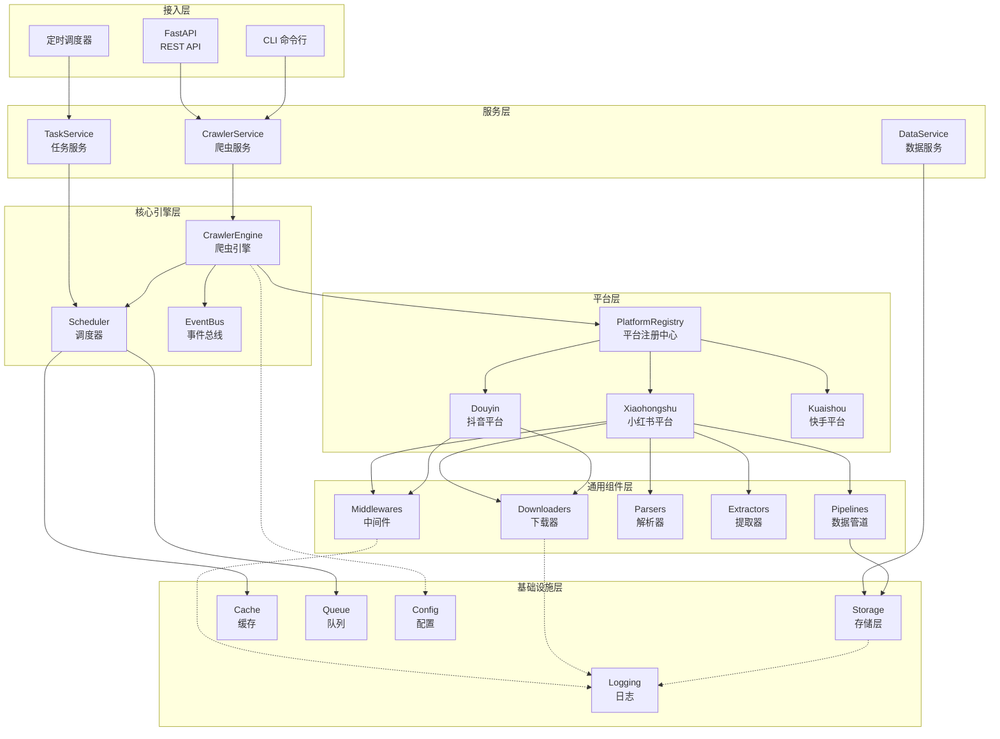
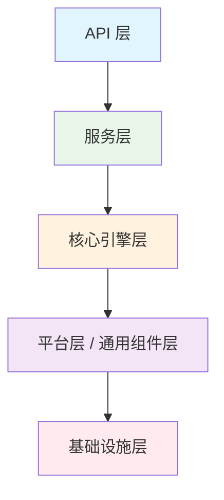
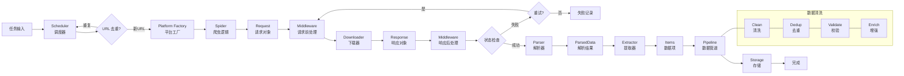
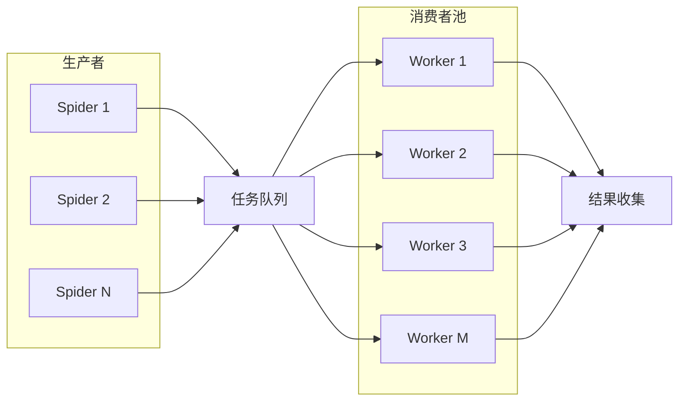
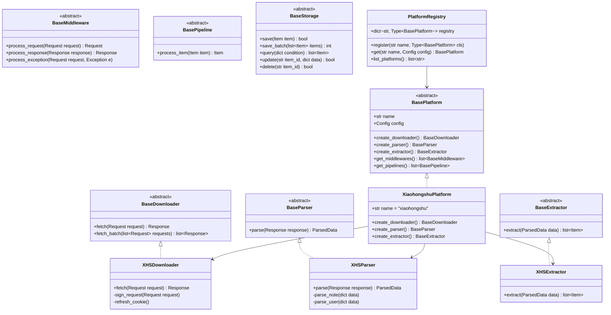
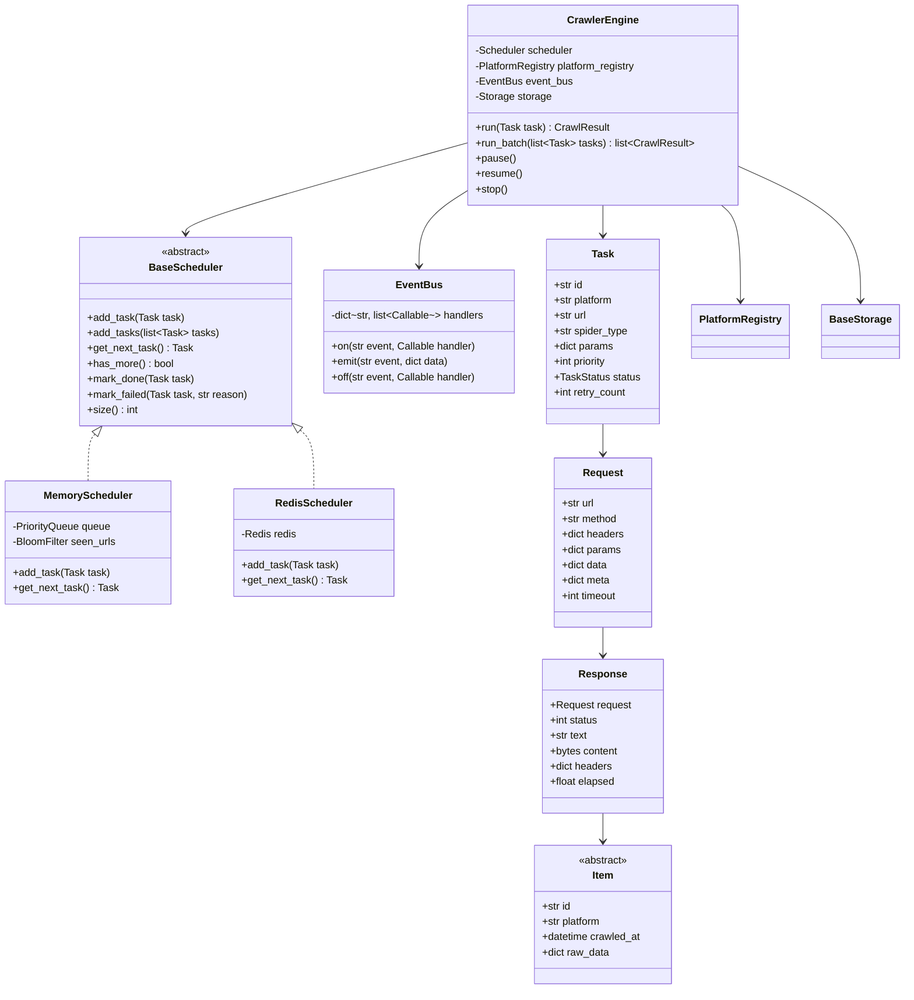
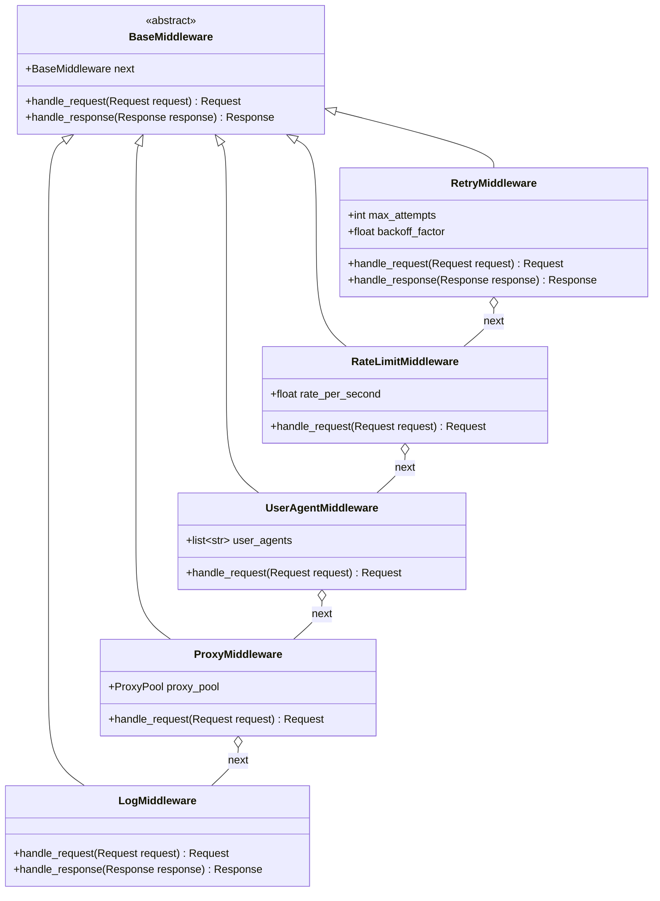

# 企业级多平台爬虫框架架构设计文档

> **版本**: v1.0  
> **日期**: 2026-07-22  
> **状态**: 待审核

---

## 目录

1. [架构设计原则](#一架构设计原则)
2. [项目目录结构](#二项目目录结构)
3. [各模块职责详解](#三各模块职责详解)
4. [核心架构设计思路](#四核心架构设计思路)
5. [平台扩展方式](#五平台扩展方式)
6. [设计模式应用](#六设计模式应用)
7. [业务流程与数据流](#七业务流程与数据流)
8. [配置管理](#八配置管理)
9. [日志系统](#九日志系统)
10. [数据存储](#十数据存储)
11. [异步能力与并发控制](#十一异步能力与并发控制)
12. [代码规范与质量保障](#十二代码规范与质量保障)
13. [推荐第三方库](#十三推荐第三方库)
14. [架构优势总结](#十四架构优势总结)
15. [UML 架构图](#十五uml-架构图)
16. [数据流图](#十六数据流图)
17. [核心类图](#十七核心类图)

---

## 一、架构设计原则

### 1.1 SOLID 原则

| 原则 | 说明 | 在本项目中的体现 |
|------|------|-----------------|
| **单一职责 (SRP)** | 一个类/模块只做一件事 | Downloader 只负责下载，Parser 只负责解析，Extractor 只负责提取 |
| **开闭原则 (OCP)** | 对扩展开放，对修改关闭 | 新增平台只需新增模块，无需修改核心代码 |
| **里氏替换 (LSP)** | 子类可替换父类 | 所有 Platform 实现统一接口，可互相替换 |
| **接口隔离 (ISP)** | 接口最小化 | 细分 Downloader、Parser、Extractor、Storage 等细粒度接口 |
| **依赖倒置 (DIP)** | 依赖抽象而非具体 | 高层模块依赖接口，不依赖具体实现类 |

### 1.2 其他核心原则

- **高内聚、低耦合**: 平台内部高度内聚，平台之间完全解耦
- **分层架构**: 清晰的层级划分，单向依赖
- **面向接口编程**: 所有核心能力通过接口定义
- **模块化设计**: 功能边界清晰，可独立演进
- **插件化设计**: 平台以插件形式接入，自动注册发现
- **配置驱动**: 行为由配置控制，代码仅提供能力
- **可测试性**: 依赖注入便于单元测试与 Mock

---

## 二、项目目录结构

```
sucrawler/
├── sucrawler/                          # 源码根目录
│   ├── __init__.py
│   ├── main.py                         # 程序入口
│   │
│   ├── core/                           # 核心层 - 框架核心能力
│   │   ├── __init__.py
│   │   ├── interfaces/                 # 核心接口定义（抽象基类）
│   │   │   ├── __init__.py
│   │   │   ├── downloader.py           # Downloader 抽象基类
│   │   │   ├── parser.py               # Parser 抽象基类
│   │   │   ├── extractor.py            # Extractor 抽象基类
│   │   │   ├── storage.py              # Storage 抽象基类
│   │   │   ├── middleware.py           # Middleware 抽象基类
│   │   │   ├── pipeline.py             # Pipeline 抽象基类
│   │   │   ├── scheduler.py            # Scheduler 抽象基类
│   │   │   └── platform.py             # Platform 抽象基类
│   │   ├── base/                       # 基础实现类
│   │   │   ├── __init__.py
│   │   │   ├── base_downloader.py      # 基础下载器（含重试、限流）
│   │   │   ├── base_parser.py          # 基础解析器
│   │   │   ├── base_extractor.py       # 基础提取器
│   │   │   ├── base_middleware.py      # 基础中间件
│   │   │   ├── base_pipeline.py        # 基础 Pipeline
│   │   │   └── base_crawler.py         # 基础爬虫模板
│   │   ├── engine.py                   # 爬虫引擎（编排核心）
│   │   ├── request.py                  # 请求对象封装
│   │   ├── response.py                 # 响应对象封装
│   │   ├── item.py                     # 数据项基类
│   │   ├── spider.py                   # Spider 基类
│   │   └── events.py                   # 事件总线
│   │
│   ├── platforms/                      # 平台层 - 各平台独立实现
│   │   ├── __init__.py
│   │   ├── registry.py                 # 平台注册中心（工厂）
│   │   ├── xiaohongshu/                # 小红书平台
│   │   │   ├── __init__.py
│   │   │   ├── platform.py             # 小红书 Platform 实现
│   │   │   ├── config.py               # 小红书专属配置
│   │   │   ├── api/                    # 小红书 API 封装
│   │   │   │   ├── __init__.py
│   │   │   │   ├── note_api.py         # 笔记相关 API
│   │   │   │   ├── user_api.py         # 用户相关 API
│   │   │   │   ├── comment_api.py      # 评论相关 API
│   │   │   │   └── search_api.py       # 搜索相关 API
│   │   │   ├── downloader.py           # 小红书下载器（签名、Cookie）
│   │   │   ├── parser.py               # 小红书解析器
│   │   │   ├── extractor.py            # 小红书数据提取器
│   │   │   ├── models/                 # 小红书数据模型
│   │   │   │   ├── __init__.py
│   │   │   │   ├── note.py             # 笔记模型
│   │   │   │   ├── user.py             # 用户模型
│   │   │   │   ├── comment.py          # 评论模型
│   │   │   │   └── media.py            # 媒体模型
│   │   │   ├── middlewares/            # 小红书专属中间件
│   │   │   │   ├── __init__.py
│   │   │   │   ├── sign_middleware.py  # 签名中间件
│   │   │   │   └── cookie_middleware.py # Cookie 中间件
│   │   │   ├── spiders/                # 小红书爬虫脚本
│   │   │   │   ├── __init__.py
│   │   │   │   ├── note_spider.py      # 笔记爬虫
│   │   │   │   ├── user_spider.py      # 用户爬虫
│   │   │   │   └── comment_spider.py   # 评论爬虫
│   │   │   └── utils/                  # 小红书工具函数
│   │   │       ├── __init__.py
│   │   │       └── sign.py             # 签名算法
│   │   ├── douyin/                     # 抖音平台（预留）
│   │   │   └── ...
│   │   ├── kuaishou/                   # 快手平台（预留）
│   │   │   └── ...
│   │   └── weibo/                      # 微博平台（预留）
│   │       └── ...
│   │
│   ├── downloaders/                    # 通用下载器实现
│   │   ├── __init__.py
│   │   ├── httpx_downloader.py         # httpx 异步下载器
│   │   ├── aiohttp_downloader.py       # aiohttp 下载器
│   │   ├── playwright_downloader.py    # Playwright 浏览器下载器
│   │   └── proxy/                      # 代理池管理
│   │       ├── __init__.py
│   │       ├── proxy_pool.py           # 代理池
│   │       └── proxy_rotator.py        # 代理轮换器
│   │
│   ├── parsers/                        # 通用解析器实现
│   │   ├── __init__.py
│   │   ├── html_parser.py              # HTML 解析器
│   │   ├── json_parser.py              # JSON 解析器
│   │   └── xml_parser.py               # XML 解析器
│   │
│   ├── extractors/                     # 通用提取器
│   │   ├── __init__.py
│   │   ├── regex_extractor.py          # 正则提取器
│   │   ├── xpath_extractor.py          # XPath 提取器
│   │   └── css_extractor.py            # CSS 选择器提取器
│   │
│   ├── pipelines/                      # 数据管道
│   │   ├── __init__.py
│   │   ├── clean_pipeline.py           # 数据清洗
│   │   ├── dedup_pipeline.py           # 去重管道
│   │   ├── validate_pipeline.py        # 数据校验
│   │   └── enrich_pipeline.py          # 数据增强
│   │
│   ├── middlewares/                    # 通用中间件
│   │   ├── __init__.py
│   │   ├── retry_middleware.py         # 重试中间件
│   │   ├── rate_limit_middleware.py    # 限流中间件
│   │   ├── user_agent_middleware.py    # UA 轮换中间件
│   │   ├── proxy_middleware.py         # 代理中间件
│   │   ├── log_middleware.py           # 日志中间件
│   │   └── stats_middleware.py         # 统计中间件
│   │
│   ├── storage/                        # 存储层
│   │   ├── __init__.py
│   │   ├── registry.py                 # 存储注册中心
│   │   ├── relational/                 # 关系型数据库
│   │   │   ├── __init__.py
│   │   │   ├── mysql_storage.py        # MySQL 存储
│   │   │   ├── postgres_storage.py     # PostgreSQL 存储
│   │   │   └── sqlite_storage.py       # SQLite 存储
│   │   ├── nosql/                      # NoSQL 数据库
│   │   │   ├── __init__.py
│   │   │   ├── mongodb_storage.py      # MongoDB 存储
│   │   │   └── redis_storage.py        # Redis 存储
│   │   ├── search/                     # 搜索引擎
│   │   │   ├── __init__.py
│   │   │   └── es_storage.py           # Elasticsearch 存储
│   │   └── file/                       # 文件存储
│   │       ├── __init__.py
│   │       ├── csv_storage.py          # CSV 存储
│   │       ├── json_storage.py         # JSON 存储
│   │       └── image_storage.py        # 图片/视频存储
│   │
│   ├── scheduler/                      # 调度器
│   │   ├── __init__.py
│   │   ├── memory_scheduler.py         # 内存调度器
│   │   ├── redis_scheduler.py          # Redis 调度器（分布式）
│   │   ├── priority_queue.py           # 优先级队列
│   │   └── bloom_filter.py             # 布隆过滤器（去重）
│   │
│   ├── models/                         # 通用数据模型
│   │   ├── __init__.py
│   │   ├── base.py                     # 基础模型
│   │   ├── enums.py                    # 枚举定义
│   │   └── mixins.py                   # 模型 Mixin
│   │
│   ├── services/                       # 服务层
│   │   ├── __init__.py
│   │   ├── crawler_service.py          # 爬虫服务
│   │   ├── task_service.py             # 任务服务
│   │   └── data_service.py             # 数据服务
│   │
│   ├── repositories/                   # 仓储层（数据访问）
│   │   ├── __init__.py
│   │   ├── task_repository.py          # 任务仓储
│   │   └── data_repository.py          # 数据仓储
│   │
│   ├── config/                         # 配置管理
│   │   ├── __init__.py
│   │   ├── loader.py                   # 配置加载器
│   │   ├── settings.py                 # 配置模型（Pydantic）
│   │   └── validator.py                # 配置校验器
│   │
│   ├── common/                         # 公共模块
│   │   ├── __init__.py
│   │   ├── constants.py                # 常量定义
│   │   ├── exceptions.py               # 异常定义
│   │   ├── types.py                    # 类型别名
│   │   └── decorators.py               # 装饰器
│   │
│   ├── utils/                          # 工具函数
│   │   ├── __init__.py
│   │   ├── http.py                     # HTTP 工具
│   │   ├── string.py                   # 字符串工具
│   │   ├── time.py                     # 时间工具
│   │   ├── crypto.py                   # 加密/签名工具
│   │   └── file.py                     # 文件工具
│   │
│   └── logging/                        # 日志模块
│       ├── __init__.py
│       ├── logger.py                   # 日志器封装
│       ├── formatters.py               # 日志格式化
│       ├── handlers.py                 # 日志处理器
│       └── trace.py                    # Trace ID 管理
│
├── config/                             # 配置文件目录
│   ├── base.yaml                       # 基础配置
│   ├── dev.yaml                        # 开发环境
│   ├── test.yaml                       # 测试环境
│   └── prod.yaml                       # 生产环境
│
├── api/                                # API 层（可选，对外提供服务）
│   ├── __init__.py
│   ├── app.py                          # FastAPI 应用
│   ├── routes/                         # 路由
│   │   ├── __init__.py
│   │   ├── task_routes.py              # 任务相关接口
│   │   └── data_routes.py              # 数据相关接口
│   └── schemas/                        # 请求/响应模型
│       ├── __init__.py
│       ├── task_schema.py
│       └── data_schema.py
│
├── scripts/                            # 脚本目录
│   ├── run_spider.py                   # 运行爬虫
│   ├── init_db.py                      # 初始化数据库
│   └── migrate_config.py               # 配置迁移
│
├── tests/                              # 测试目录
│   ├── __init__.py
│   ├── conftest.py                     # pytest 配置
│   ├── unit/                           # 单元测试
│   │   ├── core/
│   │   ├── platforms/
│   │   └── storage/
│   ├── integration/                    # 集成测试
│   │   └── ...
│   └── fixtures/                       # 测试夹具
│       └── ...
│
├── docs/                               # 文档目录
│   ├── architecture.md                 # 架构文档
│   ├── platform-guide.md               # 平台开发指南
│   └── api.md                          # API 文档
│
├── logs/                               # 日志输出目录
│   └── .gitkeep
│
├── data/                               # 数据输出目录
│   └── .gitkeep
│
├── pyproject.toml                      # 项目配置（Ruff、Black、isort、mypy）
├── requirements.txt                    # 依赖清单
├── requirements-dev.txt                # 开发依赖
├── pytest.ini                          # pytest 配置
├── .env.example                        # 环境变量示例
├── .gitignore
├── README.md
└── LICENSE
```

---

## 三、各模块职责详解

### 3.1 核心层 (`core/`)

**职责**: 定义框架的核心抽象与基础实现，是整个框架的骨架。

| 模块 | 职责 | 设计理由 |
|------|------|---------|
| `interfaces/` | 定义所有核心接口（Downloader、Parser、Extractor 等） | 面向接口编程，依赖倒置原则，高层模块不依赖具体实现 |
| `base/` | 提供各接口的基础模板实现 | 模板方法模式，抽取公共逻辑，减少重复代码 |
| `engine.py` | 爬虫引擎，协调整个爬虫流程 | 门面模式，对外提供统一入口，内部编排各组件 |
| `request/response.py` | 请求与响应的统一封装 | 隔离底层 HTTP 库差异，便于切换实现 |
| `item.py` | 数据项基类 | 统一数据流转格式 |
| `spider.py` | Spider 基类 | 定义爬虫的生命周期钩子 |
| `events.py` | 事件总线 | 解耦组件间通信，支持插件扩展 |

**协作关系**:
- `core/` 被所有上层模块依赖
- `platforms/` 实现 `core/interfaces/` 中定义的接口
- `base/` 为平台实现提供默认行为

### 3.2 平台层 (`platforms/`)

**职责**: 各平台的独立实现，完全解耦。

| 模块 | 职责 | 设计理由 |
|------|------|---------|
| `registry.py` | 平台注册中心（工厂） | 工厂模式，根据平台名创建对应实例 |
| `{platform}/platform.py` | 平台主类，组装该平台所有组件 | 组合模式，对外暴露统一的 Platform 接口 |
| `{platform}/api/` | 平台 API 封装 | 高内聚，所有 API 调用集中管理 |
| `{platform}/downloader.py` | 平台专属下载器 | 处理签名、Cookie、加密等平台特有逻辑 |
| `{platform}/parser.py` | 平台响应解析 | 将平台响应转为统一结构 |
| `{platform}/extractor.py` | 数据提取 | 从解析结果中提取结构化数据 |
| `{platform}/models/` | 平台数据模型 | 高内聚，数据定义与平台逻辑放在一起 |
| `{platform}/middlewares/` | 平台专属中间件 | 签名、Cookie 等平台特有拦截逻辑 |
| `{platform}/spiders/` | 具体爬虫脚本 | 业务逻辑与平台能力分离 |
| `{platform}/utils/` | 平台工具函数 | 签名算法等平台专属工具 |

**设计理由**:
- **高内聚**: 一个平台的所有相关代码放在同一目录下
- **低耦合**: 平台之间没有互相引用，通过核心接口交互
- **开闭原则**: 新增平台只需新增目录，不修改已有代码
- **易于维护**: 修改某平台不影响其他平台

### 3.3 下载器层 (`downloaders/`)

**职责**: 提供通用的 HTTP 下载实现。

| 模块 | 职责 |
|------|------|
| `httpx_downloader.py` | 基于 httpx 的异步下载器 |
| `aiohttp_downloader.py` | 基于 aiohttp 的下载器 |
| `playwright_downloader.py` | 基于 Playwright 的浏览器下载器（处理 JS 渲染） |
| `proxy/proxy_pool.py` | 代理池管理 |
| `proxy/proxy_rotator.py` | 代理轮换策略 |

**设计理由**:
- 策略模式，可根据任务类型选择不同的下载器
- 浏览器下载器用于处理复杂的 JS 渲染页面
- 代理池独立管理，支持多种代理提供商

### 3.4 解析/提取层 (`parsers/`, `extractors/`)

**职责**: 通用的内容解析与数据提取工具。

| 模块 | 职责 |
|------|------|
| `html_parser.py` | HTML 解析（BeautifulSoup/lxml） |
| `json_parser.py` | JSON 解析 |
| `regex_extractor.py` | 正则表达式提取 |
| `xpath_extractor.py` | XPath 提取 |
| `css_extractor.py` | CSS 选择器提取 |

**设计理由**:
- 平台的 Parser 可组合使用这些通用解析器
- 关注点分离，解析与业务提取分开

### 3.5 中间件层 (`middlewares/`)

**职责**: 请求/响应的横切关注点处理。

| 模块 | 职责 |
|------|------|
| `retry_middleware.py` | 自动重试（指数退避） |
| `rate_limit_middleware.py` | 请求限流（令牌桶/漏桶） |
| `user_agent_middleware.py` | User-Agent 轮换 |
| `proxy_middleware.py` | 代理中间件 |
| `log_middleware.py` | 请求日志记录 |
| `stats_middleware.py` | 统计信息收集 |

**设计理由**:
- 责任链模式，中间件可灵活组合
- 横切关注点与业务逻辑分离
- 通用中间件复用，平台专属中间件放在平台内

### 3.6 Pipeline 层 (`pipelines/`)

**职责**: 数据处理管道，对提取的数据进行清洗、校验、增强等。

| 模块 | 职责 |
|------|------|
| `clean_pipeline.py` | 数据清洗（去空格、格式化） |
| `dedup_pipeline.py` | 数据去重 |
| `validate_pipeline.py` | 数据校验（Pydantic） |
| `enrich_pipeline.py` | 数据增强（补充字段） |

**设计理由**:
- 管道模式，数据按序经过多个处理阶段
- 每个 Pipeline 职责单一，可自由组合

### 3.7 存储层 (`storage/`)

**职责**: 统一的数据存储接口，支持多种存储后端。

| 模块 | 职责 |
|------|------|
| `registry.py` | 存储注册中心（工厂） |
| `relational/` | 关系型数据库存储 |
| `nosql/` | NoSQL 存储 |
| `search/` | 搜索引擎存储 |
| `file/` | 文件存储 |

**设计理由**:
- 仓储模式（Repository Pattern），业务逻辑不依赖具体存储
- 策略模式，可配置选择不同存储后端
- 支持多存储并行写入（如同时写入 MySQL 和 ES）

### 3.8 调度器 (`scheduler/`)

**职责**: 任务调度与去重。

| 模块 | 职责 |
|------|------|
| `memory_scheduler.py` | 内存调度器（单机使用） |
| `redis_scheduler.py` | Redis 调度器（分布式） |
| `priority_queue.py` | 优先级队列 |
| `bloom_filter.py` | 布隆过滤器（URL 去重） |

**设计理由**:
- 策略模式，根据部署环境选择调度器
- 调度与执行分离，支持分布式扩展

### 3.9 配置层 (`config/`)

**职责**: 统一的配置管理。

| 模块 | 职责 |
|------|------|
| `loader.py` | 配置加载器（支持 YAML/TOML/ENV） |
| `settings.py` | 配置模型（Pydantic 定义） |
| `validator.py` | 配置校验器 |

详见 [配置管理](#八配置管理) 章节。

### 3.10 日志模块 (`logging/`)

**职责**: 统一的日志管理。

详见 [日志系统](#九日志系统) 章节。

### 3.11 服务层与仓储层

| 模块 | 职责 |
|------|------|
| `services/` | 业务服务层，封装用例级别的业务逻辑 |
| `repositories/` | 数据访问层，封装对存储的操作 |

**设计理由**:
- 分层架构，职责清晰
- 服务层协调多个仓储和领域对象
- 仓储层隔离具体存储实现

---

## 四、核心架构设计思路

### 4.1 分层架构

```
┌─────────────────────────────────────┐
│           API 层 (FastAPI)           │  ← 对外接口
├─────────────────────────────────────┤
│          服务层 (Services)           │  ← 业务用例编排
├─────────────────────────────────────┤
│       爬虫引擎 (Engine/Core)         │  ← 框架核心能力
├─────────────────────────────────────┤
│   平台层 (Platforms) / 通用组件层    │  ← 平台实现 + 通用组件
├─────────────────────────────────────┤
│     存储层 (Storage) / 调度器        │  ← 基础设施
└─────────────────────────────────────┘
```

**依赖方向**: 上层依赖下层，下层不知道上层的存在。

### 4.2 平台插件化

核心思想：**平台 = 一组接口的实现集合**

1. 每个平台实现 `core/interfaces/` 中定义的接口
2. 平台通过 `platforms/registry.py` 注册
3. 引擎通过平台名从工厂获取对应实例
4. 引擎面向接口编程，不依赖具体平台

### 4.3 依赖注入

- 所有核心组件通过构造函数注入依赖
- 便于单元测试（可注入 Mock 对象）
- 便于替换实现（如切换下载器、存储后端）

### 4.4 事件驱动

- 核心组件通过事件总线发布事件
- 中间件、统计模块等订阅事件
- 进一步解耦组件间依赖

---

## 五、平台扩展方式

### 5.1 新增平台步骤

以新增 **抖音 (Douyin)** 平台为例：

#### 步骤 1: 创建平台目录结构

```
platforms/
└── douyin/
    ├── __init__.py
    ├── platform.py         # 必须
    ├── config.py
    ├── api/
    ├── downloader.py
    ├── parser.py
    ├── extractor.py
    ├── models/
    ├── middlewares/
    ├── spiders/
    └── utils/
```

#### 步骤 2: 实现 Platform 接口

```python
# platforms/douyin/platform.py
from sucrawler.core.interfaces.platform import BasePlatform
from sucrawler.core.interfaces.downloader import BaseDownloader
from sucrawler.core.interfaces.parser import BaseParser
from sucrawler.core.interfaces.extractor import BaseExtractor

class DouyinPlatform(BasePlatform):
    """抖音平台实现"""
    
    name = "douyin"
    
    def create_downloader(self) -> BaseDownloader:
        from .downloader import DouyinDownloader
        return DouyinDownloader(self.config)
    
    def create_parser(self) -> BaseParser:
        from .parser import DouyinParser
        return DouyinParser(self.config)
    
    def create_extractor(self) -> BaseExtractor:
        from .extractor import DouyinExtractor
        return DouyinExtractor(self.config)
    
    def get_middlewares(self) -> list:
        from .middlewares.sign_middleware import SignMiddleware
        return [SignMiddleware(self.config)]
```

#### 步骤 3: 在注册中心注册

```python
# platforms/registry.py
from .xiaohongshu.platform import XiaohongshuPlatform
from .douyin.platform import DouyinPlatform  # 新增

PLATFORM_REGISTRY = {
    "xiaohongshu": XiaohongshuPlatform,
    "douyin": DouyinPlatform,  # 新增
}
```

> **优化**: 也可使用装饰器自动注册，无需手动修改 registry.py

#### 步骤 4: 实现各组件

按需实现 Downloader、Parser、Extractor、Models 等。

### 5.2 复用策略

| 场景 | 复用方式 |
|------|---------|
| 通用 HTTP 下载 | 继承 `BaseDownloader` 或组合 `httpx_downloader` |
| 通用 HTML 解析 | 组合 `parsers/html_parser.py` |
| 通用中间件 | 直接使用 `middlewares/` 中的通用中间件 |
| 数据存储 | 完全复用 `storage/` 层 |
| 调度去重 | 完全复用 `scheduler/` 层 |

### 5.3 为什么符合开闭原则

- **对扩展开放**: 新增平台只需要新增目录和注册
- **对修改关闭**: 核心引擎、通用组件无需修改
- **唯一可能修改的地方**: `registry.py`（可通过自动发现消除）

---

## 六、设计模式应用

### 6.1 工厂模式 (Factory Pattern)

**应用位置**: `platforms/registry.py`、`storage/registry.py`

**为什么使用**:
- 根据配置动态创建平台/存储实例
- 客户端无需知道具体实现类
- 新增产品只需注册，不改客户端代码

### 6.2 策略模式 (Strategy Pattern)

**应用位置**: Downloader、Storage、Scheduler 的多种实现

**为什么使用**:
- 运行时可切换不同算法/实现
- 每个实现独立演化，互不影响
- 符合单一职责原则

### 6.3 模板方法模式 (Template Method)

**应用位置**: `core/base/` 中的基础类

**为什么使用**:
- 抽取公共流程到基类
- 子类只需实现差异化步骤
- 减少代码重复

### 6.4 责任链模式 (Chain of Responsibility)

**应用位置**: Middleware、Pipeline

**为什么使用**:
- 中间件/Pipeline 可动态组合
- 每个处理节点职责单一
- 灵活调整处理顺序

### 6.5 适配器模式 (Adapter Pattern)

**应用位置**: 各平台的 Parser（将平台响应适配为统一格式）

**为什么使用**:
- 将不同平台的异构数据转为统一结构
- 上层逻辑与平台数据格式解耦

### 6.6 单例模式 (Singleton)

**应用位置**: 配置对象、日志器、引擎实例

**为什么使用**:
- 全局唯一实例，避免重复初始化
- 统一管理全局状态

### 6.7 依赖注入 (Dependency Injection)

**应用位置**: 所有核心组件的构造函数

**为什么使用**:
- 组件间松耦合
- 易于单元测试（注入 Mock）
- 易于替换实现

### 6.8 仓储模式 (Repository Pattern)

**应用位置**: `repositories/`、`storage/`

**为什么使用**:
- 业务逻辑不依赖具体存储技术
- 可灵活切换存储后端
- 统一数据访问接口

### 6.9 门面模式 (Facade Pattern)

**应用位置**: `core/engine.py`、`services/`

**为什么使用**:
- 对外提供简单统一的入口
- 隐藏内部复杂的组件协作
- 降低客户端使用成本

---

## 七、业务流程与数据流

### 7.1 完整数据流

```
任务创建
    │
    ▼
┌─────────┐
│ 调度器   │ ← 优先级队列 + 布隆去重
└────┬────┘
     │
     ▼
┌──────────────┐
│  平台工厂     │ ← 根据 platform 字段选择平台
└──────┬───────┘
       │
       ▼
┌──────────────┐
│  Crawler/Spider │ ← 业务逻辑编排
└──────┬───────┘
       │
       ▼
┌──────────────┐
│  Middleware  │ ← 请求前处理（重试、限流、UA、代理、签名）
└──────┬───────┘
       │
       ▼
┌──────────────┐
│  Downloader  │ ← 发送 HTTP 请求 / 浏览器渲染
└──────┬───────┘
       │
       ▼
┌──────────────┐
│  Middleware  │ ← 响应后处理（日志、统计、错误处理）
└──────┬───────┘
       │
       ▼
┌──────────────┐
│   Parser     │ ← 解析响应（HTML/JSON → 中间结构）
└──────┬───────┘
       │
       ▼
┌──────────────┐
│  Extractor   │ ← 提取结构化数据（Item）
└──────┬───────┘
       │
       ▼
┌──────────────┐
│  Pipeline    │ ← 清洗 → 去重 → 校验 → 增强
└──────┬───────┘
       │
       ▼
┌──────────────┐
│   Storage    │ ← 持久化存储（多存储后端）
└──────────────┘
```

### 7.2 各阶段详细说明

| 阶段 | 职责 | 输入 | 输出 |
|------|------|------|------|
| **任务创建** | 生成爬取任务，包含平台、URL、类型等 | 任务参数 | Task 对象 |
| **调度器** | 任务排队、优先级调度、URL 去重 | Task 列表 | 下一个待执行 Task |
| **平台工厂** | 根据平台名获取对应的 Platform 实例 | platform_name | Platform 实例 |
| **Spider** | 业务逻辑编排，决定请求什么、怎么爬 | Task | Request 对象列表 |
| **Middleware (请求前)** | 重试、限流、UA 轮换、代理、签名 | Request | 处理后的 Request |
| **Downloader** | 发送 HTTP 请求，获取响应 | Request | Response |
| **Middleware (响应后)** | 日志记录、统计、错误处理 | Response | 处理后的 Response |
| **Parser** | 解析原始响应为结构化中间格式 | Response | ParsedData |
| **Extractor** | 从解析结果中提取业务数据 Item | ParsedData | Item 列表 |
| **Pipeline** | 数据清洗、去重、校验、增强 | Item 列表 | 处理后的 Item |
| **Storage** | 数据持久化到存储后端 | Item 列表 | 存储结果 |

### 7.3 异常处理流程

```
请求失败
    │
    ├─► 状态码检查 ──► 4xx ──► 记录日志，标记失败
    │                     │
    │                     └─► 429 (限流) ──► 触发退避策略，重新入队
    │
    ├─► 网络错误 ──► 重试中间件 ──► 未超限 ──► 重新入队
    │                     │
    │                     └─► 超限 ──► 标记失败，告警
    │
    └─► 解析失败 ──► 记录日志，保存原始响应，标记失败
```

---

## 八、配置管理

### 8.1 配置文件结构

```
config/
├── base.yaml       # 基础配置（所有环境共有）
├── dev.yaml        # 开发环境覆盖
├── test.yaml       # 测试环境覆盖
└── prod.yaml       # 生产环境覆盖
```

### 8.2 配置加载逻辑

1. 加载 `base.yaml` 作为基础
2. 根据 `ENV` 环境变量加载对应环境的配置
3. 环境变量覆盖配置文件中的值（优先级最高）
4. 使用 Pydantic 进行配置校验

### 8.3 配置示例

```yaml
# base.yaml
app:
  name: "sucrawler"
  log_level: "INFO"

scheduler:
  type: "memory"  # memory / redis
  max_tasks: 1000

downloader:
  type: "httpx"  # httpx / aiohttp / playwright
  timeout: 30
  max_concurrent: 10
  retry:
    max_attempts: 3
    backoff_factor: 2

middleware:
  retry:
    enabled: true
  rate_limit:
    enabled: true
    requests_per_second: 5
  user_agent:
    enabled: true
    rotate: true

storage:
  default: "mysql"
  backends:
    mysql:
      host: "localhost"
      port: 3306
    mongodb:
      uri: "mongodb://localhost:27017"

platforms:
  xiaohongshu:
    enabled: true
    base_url: "https://www.xiaohongshu.com"
    rate_limit: 2  # 每秒请求数
```

### 8.4 配置校验

使用 Pydantic 定义配置模型，启动时自动校验：

- 必填字段检查
- 类型检查
- 范围检查（如并发数 > 0）
- 依赖检查（如启用 Redis 调度器必须配置 Redis 连接）

---

## 九、日志系统

### 9.1 日志架构

```
应用代码
    │
    ▼
┌───────────┐
│  Logger   │ ← 统一日志接口
└─────┬─────┘
      │
      ├─► Console Handler ──► 标准输出
      │
      ├─► File Handler ──► app.log (按天切割)
      │
      ├─► Error File Handler ──► error.log
      │
      ├─► Request File Handler ──► request.log
      │
      └─► JSON Formatter ──► 结构化日志
```

### 9.2 日志级别

| 级别 | 用途 |
|------|------|
| DEBUG | 调试信息，开发环境使用 |
| INFO | 正常运行信息 |
| WARNING | 警告信息（非致命错误） |
| ERROR | 错误信息（影响功能） |
| CRITICAL | 严重错误（系统不可用） |

### 9.3 日志类型

- **应用日志**: 应用运行日志
- **请求日志**: 每个请求的详细信息（URL、状态码、耗时、Trace ID）
- **错误日志**: ERROR 及以上级别单独输出
- **审计日志**: 关键操作记录

### 9.4 核心特性

| 特性 | 实现方案 |
|------|---------|
| Trace ID | 每个请求/任务分配唯一 Trace ID，贯穿全链路 |
| JSON 格式 | 生产环境输出 JSON 日志，便于采集分析 |
| 日志切割 | 按天切割，保留指定天数，压缩历史日志 |
| 结构化字段 | 平台名、任务ID、Spider名等字段自动注入 |
| 异步写入 | 异步写入文件，不阻塞主流程 |

### 9.5 推荐方案

- **主选**: `loguru` — 简洁易用，功能强大
- **备选**: 标准库 `logging` + `structlog`

---

## 十、数据存储

### 10.1 存储架构

```
业务代码
    │
    ▼
┌─────────────────┐
│  Storage 接口    │ ← 统一存储接口
└────────┬────────┘
         │
    ┌────┴────┬────────┬────────┐
    ▼         ▼        ▼        ▼
  MySQL   MongoDB    Redis      ES
   │         │        │        │
   └─────────┴────────┴────────┘
              │
              ▼
         多存储并行写入
```

### 10.2 存储接口设计

```python
class BaseStorage:
    """存储抽象基类"""
    
    async def save(self, item: Item) -> bool:
        """保存单个数据项"""
        raise NotImplementedError
    
    async def save_batch(self, items: list[Item]) -> int:
        """批量保存"""
        raise NotImplementedError
    
    async def query(self, condition: dict) -> list[Item]:
        """查询数据"""
        raise NotImplementedError
    
    async def update(self, item_id: str, data: dict) -> bool:
        """更新数据"""
        raise NotImplementedError
    
    async def delete(self, item_id: str) -> bool:
        """删除数据"""
        raise NotImplementedError
```

### 10.3 各存储适用场景

| 存储类型 | 适用场景 | 优势 |
|----------|---------|------|
| **MySQL** | 结构化数据、事务性操作 | ACID、复杂查询、成熟稳定 |
| **PostgreSQL** | 复杂查询、JSON 字段 | 功能强大、JSONB 支持好 |
| **MongoDB** | 半结构化数据、灵活 Schema |  Schema 灵活、写入性能好 |
| **Redis** | 缓存、队列、去重 | 高性能、多种数据结构 |
| **SQLite** | 小型项目、本地数据 | 无需部署、轻量 |
| **Elasticsearch** | 全文检索、日志分析 | 全文搜索、聚合分析 |
| **CSV** | 数据导出、离线分析 | 通用格式、易读 |
| **JSON** | 数据交换、备份 | 结构化、易解析 |

### 10.4 多存储策略

支持配置多个存储后端并行写入：

```yaml
storage:
  backends:
    - type: mysql
      name: primary
    - type: elasticsearch
      name: search
      sync_from: primary  # 异步同步
```

---

## 十一、异步能力与并发控制

### 11.1 异步架构

- **异步框架**: `asyncio`
- **HTTP 客户端**: `httpx`（异步）或 `aiohttp`
- **全链路异步**: Downloader → Parser → Pipeline → Storage 均支持异步

### 11.2 并发控制

| 机制 | 实现 | 作用 |
|------|------|------|
| **信号量** | `asyncio.Semaphore` | 限制最大并发请求数 |
| **限流** | 令牌桶算法 | 控制请求速率（QPS） |
| **连接池** | httpx/aiohttp 内置 | 复用 TCP 连接 |
| **队列** | `asyncio.Queue` | 生产者-消费者模式 |

### 11.3 重试机制

- **重试条件**: 网络错误、5xx 状态码、429 限流
- **重试策略**: 指数退避（Exponential Backoff）
- **抖动**: 增加随机抖动，避免惊群效应
- **最大重试次数**: 可配置，避免无限重试

### 11.4 代理池

- 支持多种代理提供商
- 代理质量检测（可用性、延迟）
- 代理自动轮换
- 失败代理自动剔除与恢复

### 11.5 Cookie 池

- 多账号 Cookie 管理
- Cookie 自动轮换
- Cookie 失效检测与刷新
- 扫码登录获取 Cookie（辅助工具）

---

## 十二、代码规范与质量保障

### 12.1 技术栈要求

| 类别 | 工具/标准 | 说明 |
|------|----------|------|
| **Python 版本** | 3.12+ | 使用最新语法特性 |
| **类型提示** | Type Hints | 所有函数/类都有类型注解 |
| **数据模型** | Pydantic / dataclass | 数据模型用 Pydantic，简单结构用 dataclass |
| **代码风格** | PEP 8 | 遵循 Python 官方风格指南 |

### 12.2 代码质量工具

| 工具 | 作用 | 配置位置 |
|------|------|---------|
| **Ruff** | 代码 lint（替代 flake8 + isort） | `pyproject.toml` |
| **Black** | 代码格式化 | `pyproject.toml` |
| **mypy** | 静态类型检查 | `pyproject.toml` |
| **pytest** | 单元测试框架 | `pytest.ini` |
| **pytest-cov** | 测试覆盖率 | `pytest.ini` |

### 12.3 项目配置 (`pyproject.toml`)

```toml
[tool.ruff]
line-length = 100
target-version = "py312"

[tool.ruff.lint]
select = ["E", "F", "I", "B", "UP", "N", "W"]

[tool.black]
line-length = 100
target-version = ["py312"]

[tool.mypy]
python_version = "3.12"
strict = true
```

### 12.4 测试策略

- **单元测试**: 覆盖核心组件、工具函数
- **集成测试**: 端到端流程测试
- **Mock**: 外部依赖全部 Mock
- **覆盖率**: 核心模块覆盖率 ≥ 80%

---

## 十三、推荐第三方库

### 13.1 核心依赖

| 库名 | 用途 | 推荐理由 |
|------|------|---------|
| `httpx` | 异步 HTTP 客户端 | 全异步、支持 HTTP/2、API 现代 |
| `aiohttp` | 异步 HTTP 客户端 | 成熟稳定、生态丰富 |
| `pydantic` | 数据模型 + 配置管理 | 类型安全、校验强大、性能好 |
| `loguru` | 日志 | 简洁易用、功能全面 |
| `pyyaml` | YAML 解析 | 标准选择 |
| `python-dotenv` | 环境变量加载 | 标准选择 |

### 13.2 解析与提取

| 库名 | 用途 | 推荐理由 |
|------|------|---------|
| `beautifulsoup4` | HTML 解析 | 易用、容错性好 |
| `lxml` | HTML/XML 解析 | 高性能、支持 XPath |
| `parsel` | 提取器 | Scrapy 同款，支持 CSS/XPath |

### 13.3 浏览器渲染

| 库名 | 用途 | 推荐理由 |
|------|------|---------|
| `playwright` | 浏览器自动化 | 现代、异步、多浏览器支持 |

### 13.4 数据存储

| 库名 | 用途 |
|------|------|
| `sqlalchemy` | ORM（关系型数据库） |
| `asyncmy` | MySQL 异步驱动 |
| `asyncpg` | PostgreSQL 异步驱动 |
| `motor` | MongoDB 异步驱动 |
| `redis-py` | Redis 客户端（支持异步） |
| `elasticsearch` | ES 客户端 |

### 13.5 调度与队列

| 库名 | 用途 |
|------|------|
| `APScheduler` | 任务调度 |
| `celery` | 分布式任务队列（可选） |
| `arq` | 基于 Redis 的异步任务队列 |

### 13.6 开发工具

| 库名 | 用途 |
|------|------|
| `pytest` | 单元测试 |
| `pytest-asyncio` | 异步测试 |
| `pytest-cov` | 覆盖率 |
| `ruff` | Lint + 排序 |
| `black` | 格式化 |
| `mypy` | 类型检查 |
| `pre-commit` | Git 钩子 |

### 13.7 API 层（可选）

| 库名 | 用途 |
|------|------|
| `fastapi` | Web 框架 |
| `uvicorn` | ASGI 服务器 |

---

## 十四、架构优势总结

### 14.1 高扩展性

| 维度 | 体现 |
|------|------|
| **平台扩展** | 新增平台只需新增目录，不改核心代码 |
| **存储扩展** | 新增存储后端只需实现 Storage 接口并注册 |
| **中间件扩展** | 新增中间件只需实现 Middleware 接口，配置启用 |
| **Pipeline 扩展** | 新增数据处理环节只需实现 Pipeline 接口 |
| **下载器扩展** | 新增下载方式只需实现 Downloader 接口 |

### 14.2 高可维护性

| 维度 | 体现 |
|------|------|
| **职责清晰** | 每层每个模块职责明确，符合单一职责 |
| **分层明确** | 单向依赖，理解成本低 |
| **接口稳定** | 面向接口编程，内部实现可自由演进 |
| **平台解耦** | 修改某平台不影响其他平台 |
| **配置驱动** | 行为可配置，无需改代码 |

### 14.3 高复用性

| 维度 | 体现 |
|------|------|
| **核心复用** | 引擎、调度、存储、中间件等核心能力所有平台共用 |
| **通用组件复用** | 通用解析器、提取器、工具函数跨平台复用 |
| **基础类复用** | Base 类提供模板方法，子类只需实现差异部分 |
| **模型复用** | 通用数据模型与 Mixin 可被各平台模型继承 |

### 14.4 可测试性

- 依赖注入便于 Mock 外部依赖
- 接口驱动便于编写契约测试
- 模块解耦便于独立单元测试
- 分层架构便于分层测试

### 14.5 团队协作友好

- 平台独立，多人可并行开发不同平台
- 模块边界清晰，减少代码冲突
- 接口明确，沟通成本低
- 文档化的扩展指南，新人易上手

---

## 十五、UML 架构图

### 15.1 整体架构图



### 15.2 分层依赖图



---

## 十六、数据流图

### 16.1 核心数据流



### 16.2 并发数据流



---

## 十七、核心类图

### 17.1 平台与核心接口类图



### 17.2 爬虫引擎类图



### 17.3 中间件责任链



---

## 附录 A：平台开发 Checklist

新增平台时，按以下清单逐项确认：

- [ ] 创建平台目录结构
- [ ] 实现 Platform 主类（继承 BasePlatform）
- [ ] 实现 Downloader（继承 BaseDownloader）
- [ ] 实现 Parser（继承 BaseParser）
- [ ] 实现 Extractor（继承 BaseExtractor）
- [ ] 定义数据 Models（继承 Base Item）
- [ ] 实现平台专属 Middleware（如需要）
- [ ] 实现 Spider 脚本（如需要）
- [ ] 在 PlatformRegistry 注册
- [ ] 添加配置 schema
- [ ] 编写单元测试
- [ ] 编写平台文档

---

## 附录 B：关键技术决策记录

| 决策 | 选项 | 选择 | 理由 |
|------|------|------|------|
| 异步 HTTP 库 | aiohttp / httpx | httpx | API 更现代，支持 HTTP/2，同步异步统一 |
| 配置格式 | YAML / TOML / JSON | YAML | 可读性好，支持注释，生态成熟 |
| 日志库 | logging / loguru | loguru | 简洁易用，功能全面，异步友好 |
| 数据模型 | dataclass / pydantic / attrs | Pydantic | 校验强大，类型安全，性能优秀 |
| 代码格式化 | black / yapf / autopep8 | Black | 风格统一，无配置化 |
| Lint | flake8 / ruff | Ruff | 速度快，功能全，替代 flake8 + isort |

---

**文档结束**
