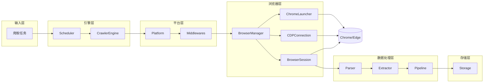
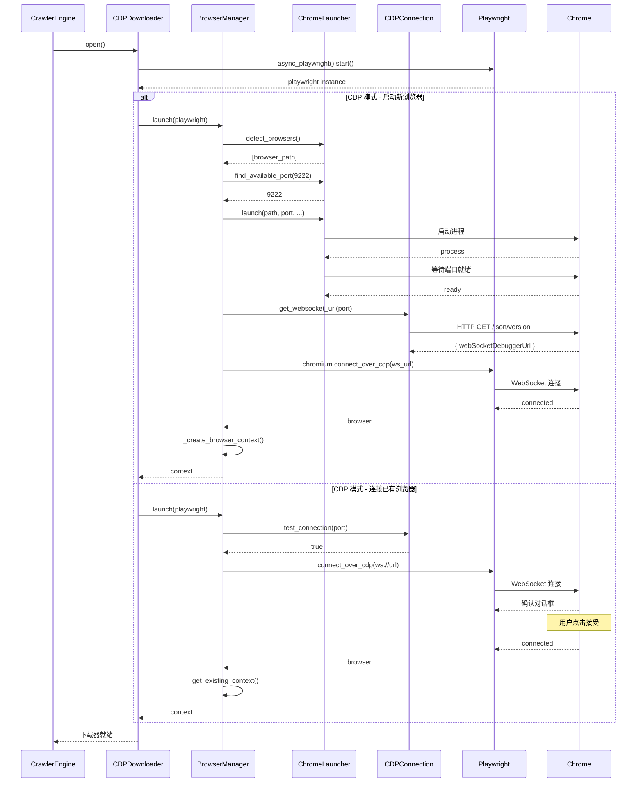
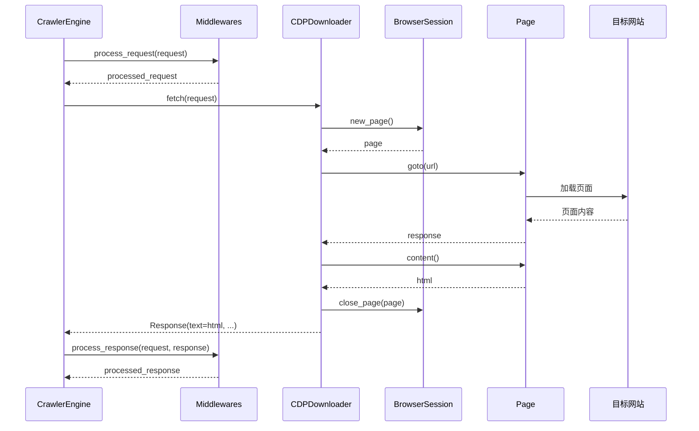
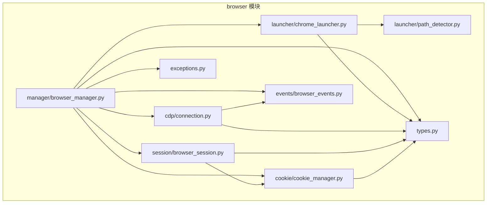
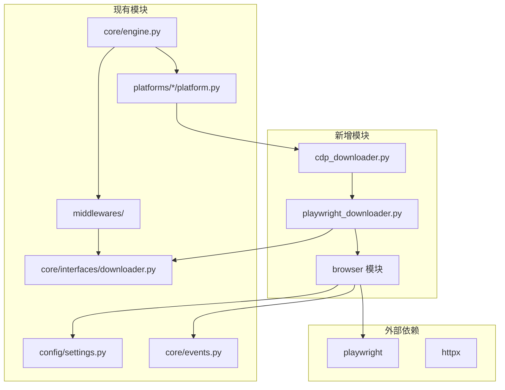
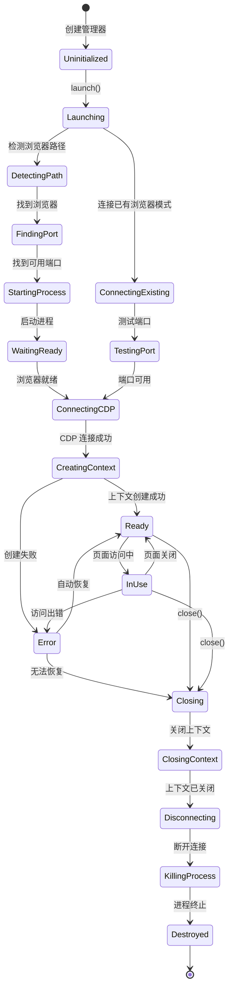
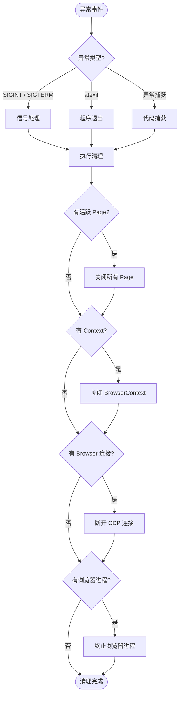
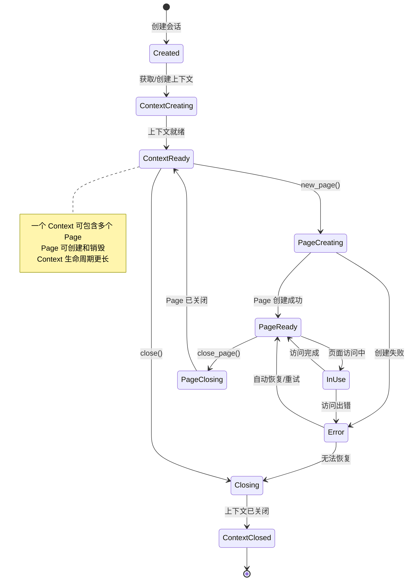

# CDP 集成架构设计文档

> **版本**: v1.0
> **日期**: 2026-07-22
> **状态**: 待审核

---

## 目录

1. [项目背景](#一项目背景)
2. [需求分析](#二需求分析)
3. [MediaCrawler CDP 架构分析](#三mediacrawler-cdp-架构分析)
4. [sucrawler 当前架构分析](#四sucrawler-当前架构分析)
5. [两者架构对比](#五两者架构对比)
6. [可迁移模块分析](#六可迁移模块分析)
7. [不可迁移模块分析](#七不可迁移模块分析)
8. [新架构设计](#八新架构设计)
9. [新目录结构](#九新目录结构)
10. [新增文件说明](#十新增文件说明)
11. [文件修改清单](#十一文件修改清单)
12. [数据流程图](#十二数据流程图)
13. [模块依赖图](#十三模块依赖图)
14. [浏览器生命周期图](#十四浏览器生命周期图)
15. [Session 生命周期图](#十五session-生命周期图)
16. [风险分析](#十六风险分析)
17. [分阶段开发计划](#十七分阶段开发计划)
18. [后续开发建议](#十八后续开发建议)

---

## 一、项目背景

### 1.1 项目概述

本项目旨在研究 **MediaCrawler** 中的 CDP（Chrome DevTools Protocol）实现，并评估将其迁移集成到 **sucrawler** 项目中的可行性。

- **参考项目**: MediaCrawler — 成熟的多平台自媒体爬虫框架，已实现 CDP 模式
- **目标项目**: sucrawler — 企业级多平台爬虫框架，架构清晰但缺少浏览器级别的反检测能力

### 1.2 CDP 技术背景

CDP（Chrome DevTools Protocol）是 Chrome 浏览器提供的一套调试协议，允许外部程序通过 WebSocket 连接直接控制浏览器。与传统的 Playwright/Puppeteer 自动化相比，CDP 模式具有以下优势：

- **真实浏览器环境**: 使用用户实际安装的浏览器，包含所有扩展、插件和个人设置
- **更好的反检测能力**: 浏览器指纹更加真实，难以被网站检测为自动化工具
- **保留用户状态**: 自动继承用户的登录状态、Cookie 和浏览历史
- **扩展支持**: 可以利用用户安装的广告拦截器、代理扩展等工具

### 1.3 参考项目位置

- MediaCrawler 项目路径: `/Users/edy/Documents/个人项目开发/速爬/MediaCrawler`
- sucrawler 项目路径: `/Users/edy/Documents/个人项目开发/速爬/sucrawler`

---

## 二、需求分析

### 2.1 核心需求

| 需求编号 | 需求描述 | 优先级 |
|---------|---------|-------|
| REQ-001 | 支持通过 CDP 协议连接和控制 Chrome/Edge 浏览器 | 高 |
| REQ-002 | 支持两种模式：启动新浏览器、连接已有浏览器 | 高 |
| REQ-003 | 浏览器路径自动检测（Windows/macOS/Linux） | 高 |
| REQ-004 | Cookie 管理（获取、设置、持久化） | 高 |
| REQ-005 | 浏览器生命周期管理（启动、连接、关闭、异常清理） | 高 |
| REQ-006 | 反检测脚本注入（stealth.min.js） | 中 |
| REQ-007 | 用户数据目录持久化（保存登录状态） | 中 |
| REQ-008 | 与现有爬虫框架无缝集成 | 高 |
| REQ-009 | 配置驱动，支持灵活切换 CDP/标准模式 | 高 |
| REQ-010 | 优雅降级：CDP 失败时自动回退到标准模式 | 中 |

### 2.2 非功能需求

| 需求编号 | 需求描述 | 指标 |
|---------|---------|------|
| NFR-001 | 性能 | 浏览器启动时间 < 10s，CDP 连接时间 < 3s |
| NFR-002 | 稳定性 | 异常退出时浏览器进程必须被正确清理 |
| NFR-003 | 可扩展性 | 新增浏览器类型或功能无需修改核心代码 |
| NFR-004 | 可测试性 | 核心模块可独立单元测试 |
| NFR-005 | 兼容性 | 支持 Chrome/Edge，覆盖 Windows/macOS/Linux |

---

## 三、MediaCrawler CDP 架构分析

### 3.1 核心模块概览

MediaCrawler 的 CDP 实现主要集中在以下模块：

| 模块 | 文件路径 | 职责 |
|------|---------|------|
| CDP 浏览器管理 | `tools/cdp_browser.py` | CDP 连接管理、浏览器上下文、Cookie、资源清理 |
| 浏览器启动器 | `tools/browser_launcher.py` | 浏览器路径检测、进程启动、端口管理、进程清理 |
| 爬虫基类 | `base/base_crawler.py` | 定义 `launch_browser_with_cdp` 抽象方法 |
| 平台实现 | `media_platform/*/core.py` | 各平台 CDP 模式启动逻辑 |
| 主入口 | `main.py` | 全局 CDP 清理、信号处理 |
| 配置 | `config/base_config.py` | CDP 相关配置项 |
| 测试 | `tests/test_cdp_browser.py` | CDP 单元测试 |

### 3.2 核心类分析

#### 3.2.1 CDPBrowserManager

**文件**: [cdp_browser.py](file:///Users/edy/Documents/个人项目开发/速爬/MediaCrawler/tools/cdp_browser.py#L35-L535)

**核心职责**:
- 浏览器启动与 CDP 连接的编排
- 浏览器上下文（BrowserContext）管理
- Cookie 操作
- 反检测脚本注入
- 资源清理与异常处理

**核心方法**:

| 方法名 | 作用 | 关键逻辑 |
|-------|------|---------|
| `launch_and_connect()` | 主入口，启动并连接浏览器 | 根据配置选择模式（已有/新启动） |
| `_connect_existing_browser()` | 连接已有浏览器 | 轮询端口、等待用户确认 |
| `_launch_browser()` | 启动新浏览器进程 | 调用 BrowserLauncher |
| `_connect_via_cdp()` | 通过 CDP 连接浏览器 | 获取 WebSocket URL，调用 Playwright |
| `_create_browser_context()` | 创建或获取浏览器上下文 | 优先复用已有上下文 |
| `add_stealth_script()` | 注入反检测脚本 | `add_init_script` |
| `add_cookies()` / `get_cookies()` | Cookie 管理 | 操作 browser_context |
| `cleanup()` | 资源清理 | 关闭上下文、断开连接、终止进程 |
| `_register_cleanup_handlers()` | 注册清理处理器 | atexit + SIGINT/SIGTERM |

#### 3.2.2 BrowserLauncher

**文件**: [browser_launcher.py](file:///Users/edy/Documents/个人项目开发/速爬/MediaCrawler/tools/browser_launcher.py#L34-L291)

**核心职责**:
- 浏览器可执行文件路径自动检测
- 浏览器进程启动（subprocess）
- 可用端口查找
- 浏览器就绪等待
- 进程清理

**核心方法**:

| 方法名 | 作用 |
|-------|------|
| `detect_browser_paths()` | 扫描系统中的 Chrome/Edge 路径 |
| `find_available_port()` | 查找可用的调试端口 |
| `launch_browser()` | 启动浏览器进程（带反检测参数） |
| `wait_for_browser_ready()` | 等待浏览器调试端口就绪 |
| `get_browser_info()` | 获取浏览器名称和版本 |
| `cleanup()` | 关闭浏览器进程（Windows/macOS/Linux 不同实现） |

#### 3.2.3 AbstractCrawler

**文件**: [base_crawler.py](file:///Users/edy/Documents/个人项目开发/速爬/MediaCrawler/base/base_crawler.py#L26-L64)

定义了 `launch_browser_with_cdp()` 方法，作为 CDP 模式的扩展点，默认回退到标准模式。

### 3.3 CDP 调用链

#### 3.3.1 启动新浏览器流程

```
main.py
  └─> CrawlerFactory.create_crawler()
      └─> XiaoHongShuCrawler.start()
          ├─> 检查 config.ENABLE_CDP_MODE
          └─> self.launch_browser_with_cdp(playwright, ...)
              └─> CDPBrowserManager.launch_and_connect()
                  ├─> _get_browser_path()
                  │   └─> BrowserLauncher.detect_browser_paths()
                  ├─> launcher.find_available_port()
                  ├─> _launch_browser()
                  │   └─> BrowserLauncher.launch_browser()
                  ├─> _register_cleanup_handlers()
                  ├─> _connect_via_cdp()
                  │   ├─> _get_browser_websocket_url()  // HTTP /json/version
                  │   └─> playwright.chromium.connect_over_cdp()
                  └─> _create_browser_context()
```

#### 3.3.2 连接已有浏览器流程

```
CDPBrowserManager.launch_and_connect()
  └─> _connect_existing_browser(playwright, ...)
      ├─> 轮询 CDP 端口（等待用户开启调试）
      ├─> _connect_via_cdp()
      │   ├─> 直接连接 ws://localhost:PORT/devtools/browser
      │   ├─> 失败则回退到 /json/version 发现
      │   └─> playwright.chromium.connect_over_cdp()
      └─> _create_browser_context()  // 复用已有上下文
```

### 3.4 配置项分析

**文件**: [base_config.py](file:///Users/edy/Documents/个人项目开发/速爬/MediaCrawler/config/base_config.py#L55-L87)

| 配置项 | 类型 | 默认值 | 说明 |
|-------|------|-------|------|
| `ENABLE_CDP_MODE` | bool | True | 是否启用 CDP 模式 |
| `CDP_DEBUG_PORT` | int | 9222 | CDP 调试端口 |
| `CUSTOM_BROWSER_PATH` | str | "" | 自定义浏览器路径 |
| `CDP_HEADLESS` | bool | False | CDP 无头模式 |
| `BROWSER_LAUNCH_TIMEOUT` | int | 60 | 浏览器启动超时（秒） |
| `CDP_CONNECT_EXISTING` | bool | True | 连接已有浏览器模式 |
| `AUTO_CLOSE_BROWSER` | bool | True | 程序结束时自动关闭浏览器 |
| `SAVE_LOGIN_STATE` | bool | True | 保存登录状态（用户数据目录） |
| `USER_DATA_DIR` | str | "%s_user_data_dir" | 用户数据目录模板 |

### 3.5 平台集成方式

以小红书为例（[xhs/core.py](file:///Users/edy/Documents/个人项目开发/速爬/MediaCrawler/media_platform/xhs/core.py#L51-L462)）：

1. **启动阶段**: 在 `start()` 方法中判断 `config.ENABLE_CDP_MODE`，选择调用 `launch_browser_with_cdp()` 或 `launch_browser()`
2. **CDP 启动**: `launch_browser_with_cdp()` 创建 `CDPBrowserManager` 实例并调用 `launch_and_connect()`
3. **优雅降级**: CDP 启动失败时捕获异常，回退到标准 Playwright 模式
4. **清理阶段**: `close()` 方法中判断是否使用 CDP，调用对应的清理逻辑

### 3.6 CDP 通用能力 vs 业务逻辑

#### 可抽离复用的 CDP 通用能力

| 模块 | 通用性 | 说明 |
|------|-------|------|
| 浏览器路径检测 | 极高 | 纯系统级操作，与业务无关 |
| 浏览器进程启动 | 极高 | 通用启动参数，反检测开关可配置 |
| CDP 连接管理 | 极高 | WebSocket 连接、Playwright 集成 |
| 浏览器上下文管理 | 高 | Context 创建、复用 |
| Cookie 管理 | 高 | 标准 Cookie 操作 |
| 资源清理与信号处理 | 高 | 进程清理、异常退出处理 |
| 端口管理 | 极高 | 可用端口查找 |

#### MediaCrawler 业务逻辑（不建议直接迁移）

| 模块 | 业务绑定度 | 说明 |
|------|-----------|------|
| 各平台爬虫核心逻辑 | 高 | 与 MediaCrawler 平台架构深度绑定 |
| 登录流程 | 高 | 各平台登录方式不同，需适配 sucrawler |
| API Client 体系 | 高 | 与 MediaCrawler 的 Client 架构耦合 |
| 数据存储体系 | 中 | 存储方式差异较大 |
| 命令行参数解析 | 低 | 可参考但需适配 |

---

## 四、sucrawler 当前架构分析

### 4.1 整体架构

sucrawler 采用分层架构设计，遵循 DDD 原则，职责清晰、高内聚低耦合。

**架构分层**:

```
┌─────────────────────────────────────┐
│           API 层 (FastAPI)           │  ← 对外接口
├─────────────────────────────────────┤
│          服务层 (Services)           │  ← 业务用例编排
├─────────────────────────────────────┤
│       爬虫引擎 (Engine/Core)         │  ← 框架核心能力
├─────────────────────────────────────┤
│   平台层 (Platforms) / 通用组件层    │  ← 平台实现 + 通用组件
├─────────────────────────────────────┤
│     存储层 (Storage) / 调度器        │  ← 基础设施
└─────────────────────────────────────┘
```

### 4.2 目录结构

```
sucrawler/sucrawler/
├── core/                    # 核心层
│   ├── interfaces/          # 核心接口定义
│   │   ├── downloader.py
│   │   ├── parser.py
│   │   ├── extractor.py
│   │   ├── middleware.py
│   │   ├── pipeline.py
│   │   ├── platform.py
│   │   ├── scheduler.py
│   │   └── storage.py
│   ├── base/                # 基础实现类
│   ├── engine.py            # 爬虫引擎
│   ├── events.py            # 事件总线
│   ├── request.py           # 请求对象
│   ├── response.py          # 响应对象
│   ├── item.py              # 数据项
│   └── spider.py            # Spider 基类
│
├── platforms/               # 平台层
│   ├── registry.py          # 平台注册中心
│   └── xiaohongshu/         # 小红书平台
│       ├── platform.py
│       ├── config.py
│       ├── downloader.py
│       ├── parser.py
│       ├── extractor.py
│       ├── api/
│       ├── middlewares/
│       ├── models/
│       └── spiders/
│
├── downloaders/             # 通用下载器
│   ├── httpx_downloader.py
│   ├── aiohttp_downloader.py
│   └── proxy/
│
├── middlewares/             # 通用中间件
├── pipelines/               # 数据管道
├── storage/                 # 存储层
├── scheduler/               # 调度器
├── config/                  # 配置管理
└── ...
```

### 4.3 核心模块分析

#### 4.3.1 CrawlerEngine

**文件**: [engine.py](file:///Users/edy/Documents/个人项目开发/速爬/sucrawler/sucrawler/core/engine.py#L38-L198)

职责：协调整个爬虫流程，包括任务调度、平台选择、中间件执行、下载、解析、提取、管道处理等。

**核心流程**:
```
run(task)
  ├─> _get_platform(task)  // 从注册中心获取平台
  └─> _crawl_task(platform, task)
      ├─> create_downloader() / parser / extractor
      ├─> 请求中间件处理
      ├─> downloader.fetch(request)
      ├─> 响应中间件处理
      ├─> parser.parse(response)
      ├─> extractor.extract(data)
      └─> pipelines 处理
```

#### 4.3.2 BasePlatform

**文件**: [platform.py](file:///Users/edy/Documents/个人项目开发/速爬/sucrawler/sucrawler/core/interfaces/platform.py#L11-L31)

定义了平台必须实现的接口：
- `create_downloader()`
- `create_parser()`
- `create_extractor()`
- `get_middlewares()`
- `get_pipelines()`

#### 4.3.3 Downloader 体系

当前下载器实现：
- [HttpxDownloader](file:///Users/edy/Documents/个人项目开发/速爬/sucrawler/sucrawler/downloaders/httpx_downloader.py#L16-L130) — 基于 httpx 的异步 HTTP 下载
- 平台专属下载器（如 XHSDownloader）— 继承基础下载器，添加平台特有逻辑

#### 4.3.4 事件总线

**文件**: [events.py](file:///Users/edy/Documents/个人项目开发/速爬/sucrawler/sucrawler/core/events.py#L22-L46)

提供了基础的事件发布订阅能力，支持同步和异步 handler。

#### 4.3.5 配置系统

**文件**: [settings.py](file:///Users/edy/Documents/个人项目开发/速爬/sucrawler/sucrawler/config/settings.py#L222-L230)

使用 Pydantic 定义配置模型，支持 YAML 文件 + 环境变量覆盖。

### 4.4 当前浏览器能力评估

| 能力 | 当前状态 | 说明 |
|------|---------|------|
| Playwright 集成 | 规划中 | 配置中有 `playwright` 下载器类型，但未实现 |
| 浏览器渲染 | 无 | 当前仅支持 HTTP 请求 |
| Cookie 管理 | 基础 | 通过中间件和下载器 headers 传递 |
| 反检测能力 | 无 | 无浏览器级别的反检测 |
| 登录态持久化 | 基础 | 依赖手动配置 Cookie |
| CDP 支持 | 无 | 完全缺失 |

### 4.5 架构适配性评估

#### 4.5.1 适合接入 CDP 的点

| 模块 | 接入方式 | 理由 |
|------|---------|------|
| Downloader 层 | 新增 `PlaywrightDownloader` / `CDPDownloader` | 符合下载器抽象，易于扩展 |
| Platform 层 | 在 Platform 中可选启用 CDP 模式 | 平台自主决定是否使用浏览器 |
| 配置系统 | 新增 CDP 配置段 | Pydantic 模型易于扩展 |
| 中间件体系 | 保持不变 | 中间件逻辑与下载方式无关 |
| 事件总线 | 可扩展浏览器相关事件 | 事件驱动架构天然支持扩展 |

#### 4.5.2 需要重构的点

| 模块 | 重构内容 | 影响范围 |
|------|---------|---------|
| Downloader 接口 | 增加生命周期管理（open/close） | 所有下载器实现 |
| 引擎层 | 支持有状态的下载器（浏览器实例） | CrawlerEngine |
| 资源管理 | 浏览器/CDP 连接的全局管理 | 新增管理器 |
| 平台配置 | 增加浏览器/CDP 相关配置 | Platform 配置模型 |

---

## 五、两者架构对比

### 5.1 功能对比

| 功能 | MediaCrawler | sucrawler | 是否可迁移 | 备注 |
|------|--------------|-----------|------------|------|
| CDP 连接管理 | ✅ 已实现 | ❌ 无 | ✅ 可直接迁移 | 核心逻辑通用 |
| 浏览器路径检测 | ✅ 已实现 | ❌ 无 | ✅ 可直接迁移 | 纯系统操作 |
| 浏览器进程启动 | ✅ 已实现 | ❌ 无 | ✅ 可直接迁移 | 启动参数需适配 |
| 连接已有浏览器 | ✅ 已实现 | ❌ 无 | ✅ 可直接迁移 | Chrome 136+ 直接连接模式 |
| Cookie 管理 | ✅ 已实现 | ⚠️ 基础 | ✅ 可迁移增强 | 浏览器级 Cookie 管理 |
| 反检测脚本注入 | ✅ 已实现 | ❌ 无 | ✅ 可迁移 | stealth.min.js |
| 用户数据持久化 | ✅ 已实现 | ❌ 无 | ✅ 可迁移 | 保存登录状态 |
| 异常清理（信号） | ✅ 已实现 | ⚠️ 部分 | ✅ 可迁移增强 | atexit + 信号处理 |
| Playwright 集成 | ✅ 已实现 | ⚠️ 规划中 | ✅ 可迁移 | 基于 Playwright 的 CDP |
| 多平台爬虫架构 | ✅ 成熟 | ✅ 完善 | ⚠️ 需适配 | 架构理念相似但实现不同 |
| 配置系统 | ⚠️ 全局变量 | ✅ Pydantic | ❌ 需重写 | 配置体系差异大 |
| 中间件体系 | ❌ 无 | ✅ 完善 | — | sucrawler 更优 |
| 数据管道 Pipeline | ❌ 无 | ✅ 完善 | — | sucrawler 更优 |
| 存储抽象 | ✅ 工厂模式 | ✅ 仓储模式 | — | 各有特色 |
| 调度器 | ❌ 无 | ✅ 完善 | — | sucrawler 更优 |
| 事件驱动 | ❌ 无 | ✅ 有 | — | sucrawler 更优 |

### 5.2 架构差异

#### 5.2.1 架构设计差异

| 维度 | MediaCrawler | sucrawler |
|------|--------------|-----------|
| **架构模式** | 单爬虫实例 + 平台继承 | 引擎驱动 + 平台插件化 |
| **核心抽象** | AbstractCrawler 基类 | 接口 + 依赖注入 |
| **扩展方式** | 继承基类，重写方法 | 实现接口，注册到工厂 |
| **流程编排** | 平台内部自行编排 | CrawlerEngine 统一编排 |
| **配置方式** | 全局 config 模块 | Pydantic + YAML + 环境变量 |
| **数据流** | Client 直接调用 Store | 中间件 → 下载器 → 解析器 → 提取器 → 管道 |
| **职责划分** | 平台内聚，功能混合 | 精细拆分，单一职责 |

#### 5.2.2 模块职责差异

| 模块 | MediaCrawler 职责 | sucrawler 职责 |
|------|-----------------|---------------|
| **下载器** | 混合在 Client 中，未单独抽象 | 独立抽象，支持多种实现 |
| **解析器** | 混合在 Client 中 | 独立抽象，Parser/Extractor 分离 |
| **中间件** | 无独立中间件层 | 完善的中间件体系（责任链） |
| **数据管道** | 无 | Pipeline 模式，多级处理 |
| **调度器** | 无（直接循环） | 独立调度器，支持优先级/去重 |
| **存储** | 平台内 StoreFactory | 统一 Storage 接口 + 注册中心 |

#### 5.2.3 生命周期差异

| 维度 | MediaCrawler | sucrawler |
|------|--------------|-----------|
| **浏览器生命周期** | 与爬虫实例绑定，start/close | 需新增浏览器管理器统一管理 |
| **爬虫生命周期** | 单实例运行，start → finish | 任务级生命周期，调度器驱动 |
| **资源管理** | 全局变量 + atexit | 需设计资源管理器 |
| **异常退出** | app_runner 统一处理 | 需集成到引擎/服务层 |

#### 5.2.4 浏览器管理方式差异

| 维度 | MediaCrawler | sucrawler（目标） |
|------|--------------|-------------------|
| **管理粒度** | 每个平台爬虫一个浏览器 | 可共享/可独立，灵活配置 |
| **绑定关系** | 与 Crawler 实例强绑定 | 与 Downloader 绑定，平台可选择 |
| **创建时机** | 爬虫启动时创建 | 首次使用时懒加载 |
| **销毁时机** | 爬虫结束或程序退出 | 下载器关闭时销毁 |
| **复用性** | 单次运行内不复用 | 支持跨任务复用浏览器 |

#### 5.2.5 网络层差异

| 维度 | MediaCrawler | sucrawler |
|------|--------------|-----------|
| **HTTP 客户端** | httpx（在 Client 内） | httpx / aiohttp（Downloader 层） |
| **浏览器请求** | Playwright Page 直接访问 | 需新增 Playwright/CDP Downloader |
| **请求拦截** | 无显式中间件 | 中间件层统一处理 |
| **Cookie 传递** | 从 BrowserContext 提取后传给 httpx | 中间件统一管理 |

#### 5.2.6 登录机制差异

| 维度 | MediaCrawler | sucrawler |
|------|--------------|-----------|
| **登录方式** | 二维码 / 手机号 / Cookie | 当前仅支持配置 Cookie |
| **登录实现** | 各平台独立 Login 类 | 尚未设计统一登录体系 |
| **登录态保存** | 用户数据目录持久化 | 手动配置 Cookie |
| **登录态刷新** | 浏览器自动处理 | 需手动更新 Cookie |

### 5.3 风险分析

#### 5.3.1 高耦合代码风险

**风险等级**: 🟡 中风险

**说明**:
- MediaCrawler 的 CDP 代码与 Playwright 强绑定（依赖 `playwright.chromium.connect_over_cdp`）
- CDPBrowserManager 直接依赖全局 `config` 模块
- 浏览器启动参数中包含特定的反检测参数，可能与业务需求耦合

**应对措施**:
- 通过接口抽象隔离 Playwright 依赖
- 配置通过构造函数注入，不依赖全局变量
- 启动参数可配置，提供合理默认值

#### 5.3.2 业务绑定风险

**风险等级**: 🟢 低风险

**说明**:
- CDP 核心能力（浏览器启动、连接、Cookie 管理）是通用的
- 平台特定的登录、爬取逻辑不纳入 CDP 模块迁移范围
- CDP 模块仅提供浏览器控制能力，不涉及具体业务

**应对措施**:
- 严格界定 CDP 模块边界：只做浏览器控制
- 业务逻辑通过 Downloader/Middleware 等方式接入
- 提供清晰的扩展点，而非内置业务逻辑

#### 5.3.3 架构改造量风险

**风险等级**: 🟡 中风险

**说明**:
- sucrawler 当前 Downloader 接口是无状态的（每次 fetch 独立）
- 浏览器/CDP 是有状态的，需要管理生命周期
- 需要新增浏览器管理器、调整引擎层协作方式

**应对措施**:
- 分阶段实施，先新增能力，再逐步优化
- 保持现有 HTTP 下载器不受影响
- 通过适配器模式兼容现有接口

#### 5.3.4 影响已有功能风险

**风险等级**: 🟢 低风险

**说明**:
- CDP 作为新增能力，默认不启用
- 现有 HTTP 下载器完全不受影响
- 平台可选择是否启用 CDP 模式

**应对措施**:
- 功能开关控制，默认关闭
- 完善的回退机制：CDP 失败时自动降级
- 充分的单元测试和集成测试

#### 5.3.5 综合风险评估

| 风险类型 | 等级 | 影响 | 概率 | 应对策略 |
|---------|------|------|------|---------|
| 高耦合代码 | 🟡 中 | 代码质量 | 中 | 接口抽象 + 依赖注入 |
| 业务绑定 | 🟢 低 | 可维护性 | 低 | 严格模块边界 |
| 架构改造量 | 🟡 中 | 开发周期 | 中 | 分阶段实施 |
| 影响已有功能 | 🟢 低 | 稳定性 | 低 | 开关控制 + 降级 |
| 环境兼容性 | 🟡 中 | 可用性 | 中 | 多平台测试 + 优雅降级 |

**总体风险等级**: 🟡 中风险

**结论**: 可以迁移，但需要做好架构设计，确保 CDP 模块与现有架构解耦，通过分阶段实施降低风险。

---

## 六、可迁移模块分析

### 6.1 高优先级可迁移模块

#### 6.1.1 浏览器路径检测

**来源**: `BrowserLauncher.detect_browser_paths()`

**迁移价值**: 极高

**迁移说明**:
- 纯系统级功能，与业务完全无关
- 覆盖 Windows/macOS/Linux 三大平台
- 支持 Chrome/Edge 的稳定版、Beta、Dev、Canary

**适配点**:
- 无需大改，直接复用
- 可补充 Linux 更多发行版的路径

#### 6.1.2 浏览器进程启动

**来源**: `BrowserLauncher.launch_browser()`

**迁移价值**: 极高

**迁移说明**:
- 标准 subprocess 启动浏览器
- 包含完善的反检测启动参数
- 跨平台进程创建（Windows/macOS/Linux）

**适配点**:
- 启动参数可配置化
- 与路径检测模块配合使用

#### 6.1.3 CDP 连接管理

**来源**: `CDPBrowserManager._connect_via_cdp()`

**迁移价值**: 极高

**迁移说明**:
- 支持两种连接模式：新启动浏览器、已有浏览器
- 支持 Chrome 136+ 直接 WebSocket 连接
- 失败回退到 /json/version 发现

**适配点**:
- 需封装 Playwright 依赖
- 配置通过参数传入，不依赖全局 config

#### 6.1.4 资源清理与信号处理

**来源**: `CDPBrowserManager.cleanup()` + `_register_cleanup_handlers()`

**迁移价值**: 高

**迁移说明**:
- 完善的资源清理：Context → Browser → Process
- atexit 注册确保程序退出时清理
- SIGINT/SIGTERM 信号处理
- 已关闭/已断开的异常容错

**适配点**:
- 需适配 sucrawler 的信号处理机制
- 需考虑多个浏览器实例的清理

#### 6.1.5 Cookie 管理

**来源**: `CDPBrowserManager.add_cookies()` + `get_cookies()`

**迁移价值**: 高

**迁移说明**:
- 基于 BrowserContext 的 Cookie 操作
- 可与中间件层的 Cookie 管理配合

**适配点**:
- 需定义与 sucrawler Cookie 中间件的交互方式
- 支持 Cookie 在 HTTP 和浏览器之间同步

### 6.2 中优先级可迁移模块

#### 6.2.1 反检测脚本注入

**来源**: `CDPBrowserManager.add_stealth_script()`

**迁移价值**: 中

**迁移说明**:
- stealth.min.js 是通用的反检测脚本
- 注入方式是标准的 Playwright API

**适配点**:
- 脚本文件路径需配置
- 需随项目分发或提供下载机制

#### 6.2.2 端口管理

**来源**: `BrowserLauncher.find_available_port()`

**迁移价值**: 中

**迁移说明**:
- 简单的端口可用性检测
- 从起始端口递增查找

**适配点**:
- 可直接复用
- 可考虑更灵活的端口策略

### 6.3 可参考但需重写的模块

#### 6.3.1 配置系统

**来源**: `config/base_config.py` 中的 CDP 配置

**说明**:
- MediaCrawler 使用全局变量配置
- sucrawler 使用 Pydantic 模型
- 需要在 sucrawler 的配置体系中新增 CDP 配置段

#### 6.3.2 平台集成方式

**来源**: 各平台 `core.py` 中的 CDP 启动逻辑

**说明**:
- MediaCrawler 是平台内部自行管理浏览器
- sucrawler 应通过 Downloader 抽象接入
- 需设计 PlaywrightCDPDownloader 作为桥梁

---

## 七、不可迁移模块分析

### 7.1 平台爬虫核心逻辑

**不可迁移原因**:
- 与 MediaCrawler 的 AbstractCrawler 体系深度绑定
- 各平台的爬取逻辑、API 调用方式差异大
- sucrawler 有自己的平台实现架构

### 7.2 登录流程

**不可迁移原因**:
- 各平台登录方式不同，且与平台 UI 深度绑定
- 登录是业务逻辑，不是 CDP 通用能力
- sucrawler 应设计自己的登录体系

### 7.3 API Client 体系

**不可迁移原因**:
- MediaCrawler 的 Client 同时负责 API 调用和数据解析
- sucrawler 采用 Downloader + Parser + Extractor 分离的架构
- 架构理念不同，直接迁移会破坏现有架构

### 7.4 数据存储体系

**不可迁移原因**:
- MediaCrawler 的存储与平台强绑定（每个平台一个 Store）
- sucrawler 的存储是通用的（Storage 接口 + 数据 Item）
- 数据模型定义方式不同

---

## 八、新架构设计

### 8.1 设计原则

1. **低耦合**: CDP 模块独立，不依赖具体业务
2. **高内聚**: 浏览器相关的所有能力集中在 browser 模块
3. **面向接口**: 依赖抽象而非具体实现
4. **配置驱动**: 行为由配置控制，代码提供能力
5. **优雅降级**: CDP 不可用时自动回退到 HTTP 模式
6. **生命周期清晰**: 明确的创建、使用、销毁流程
7. **符合现有风格**: 遵循 sucrawler 的命名、分层、设计模式

### 8.2 整体架构

```
┌─────────────────────────────────────────────────────┐
│                    CrawlerEngine                     │  ← 引擎层（不变）
└───────────────────────┬─────────────────────────────┘
                        │
          ┌─────────────┴─────────────┐
          ▼                           ▼
┌──────────────────┐      ┌──────────────────┐
│  HTTP Downloader │      │ Browser Manager  │  ← 新增浏览器管理层
│  (httpx/aiohttp) │      │                  │
└──────────────────┘      │  ┌────────────┐  │
                          │  │ CDP Client │  │  ← CDP 协议封装
                          │  └────────────┘  │
                          │  ┌────────────┐  │
                          │  │  Launcher  │  │  ← 浏览器启动器
                          │  └────────────┘  │
                          │  ┌────────────┐  │
                          │  │  Session   │  │  ← 会话管理
                          │  └────────────┘  │
                          └──────────────────┘
                                    │
                                    ▼
                          ┌──────────────────┐
                          │  Chrome / Edge   │  ← 真实浏览器
                          └──────────────────┘
```

### 8.3 核心设计模式

| 模式 | 应用位置 | 作用 |
|------|---------|------|
| **工厂模式** | BrowserFactory | 根据配置创建不同类型的浏览器管理器 |
| **单例模式** | BrowserManager | 全局唯一的浏览器管理器（可选） |
| **适配器模式** | CDPDownloader | 将浏览器能力适配为 Downloader 接口 |
| **策略模式** | 多种连接策略 | 新启动 / 连接已有 / 标准 Playwright |
| **观察者模式** | 事件总线 | 浏览器生命周期事件通知 |
| **资源管理** | Context Manager | `async with` 语法管理生命周期 |

### 8.4 模块职责划分

#### 8.4.1 browser 模块（新增）

**职责**: 所有与浏览器控制相关的能力

**子模块**:
- `cdp/` — CDP 协议相关实现
- `manager/` — 浏览器管理器（生命周期、资源管理）
- `launcher/` — 浏览器启动器（路径检测、进程启动）
- `session/` — 浏览器会话管理（Context、Page）
- `cookie/` — Cookie 管理
- `events/` — 浏览器事件定义
- `types/` — 类型定义

#### 8.4.2 与 downloaders 的关系

- 新增 `PlaywrightDownloader`（位于 `downloaders/`）
- PlaywrightDownloader 内部使用 browser 模块
- 对外暴露标准的 Downloader 接口
- 引擎层无需知道浏览器的存在

#### 8.4.3 与 platforms 的关系

- 平台通过配置决定使用哪种 Downloader
- 平台可提供专属的 PlaywrightDownloader 子类
- 平台的中间件仍然生效（请求/响应拦截）

---

## 九、新目录结构

```
sucrawler/sucrawler/
├── browser/                          # 浏览器模块（新增）
│   ├── __init__.py
│   ├── types.py                      # 类型定义
│   ├── exceptions.py                 # 浏览器相关异常
│   │
│   ├── launcher/                     # 浏览器启动器
│   │   ├── __init__.py
│   │   ├── base.py                   # 启动器抽象基类
│   │   ├── chrome_launcher.py        # Chrome/Edge 启动器
│   │   └── path_detector.py          # 浏览器路径检测器
│   │
│   ├── cdp/                          # CDP 协议层
│   │   ├── __init__.py
│   │   ├── connection.py             # CDP 连接管理
│   │   ├── websocket.py              # WebSocket 连接封装
│   │   └── target.py                 # Target 管理
│   │
│   ├── manager/                      # 浏览器管理器
│   │   ├── __init__.py
│   │   ├── browser_manager.py        # 浏览器管理器主类
│   │   ├── context_manager.py        # 上下文管理器
│   │   └── cleanup.py                # 资源清理与信号处理
│   │
│   ├── session/                      # 会话管理
│   │   ├── __init__.py
│   │   ├── browser_session.py        # 浏览器会话
│   │   └── page_pool.py              # Page 池
│   │
│   ├── cookie/                       # Cookie 管理
│   │   ├── __init__.py
│   │   ├── cookie_manager.py         # Cookie 管理器
│   │   └── cookie_store.py           # Cookie 持久化存储
│   │
│   ├── network/                      # 网络层（可选，后续扩展）
│   │   ├── __init__.py
│   │   ├── request_interceptor.py    # 请求拦截
│   │   └── response_interceptor.py   # 响应拦截
│   │
│   └── events/                       # 浏览器事件
│       ├── __init__.py
│       └── browser_events.py         # 事件定义
│
├── downloaders/
│   ├── playwright_downloader.py      # Playwright 下载器（新增）
│   ├── cdp_downloader.py             # CDP 下载器（新增，继承 PlaywrightDownloader）
│   ├── httpx_downloader.py           # 保持不变
│   ├── aiohttp_downloader.py         # 保持不变
│   └── proxy/                        # 保持不变
│
├── config/
│   └── settings.py                   # 新增 CDP 配置模型
│
└── ...
```

### 9.1 目录设计说明

#### browser/launcher/

**作用**: 负责浏览器的检测和启动

**职责**:
- 检测系统中已安装的浏览器路径
- 查找可用的调试端口
- 启动浏览器进程
- 等待浏览器就绪

**与其他模块关系**:
- 被 `manager` 调用
- 不依赖 CDP、Session 等其他模块
- 是最底层的基础能力

#### browser/cdp/

**作用**: CDP 协议的封装

**职责**:
- 建立和维护 CDP WebSocket 连接
- 管理 Target（页面、Frame 等）
- 发送 CDP 命令和接收事件

**与其他模块关系**:
- 被 `manager` 使用
- 不依赖业务逻辑
- 可独立于 Playwright 使用（纯 CDP 模式）

#### browser/manager/

**作用**: 浏览器生命周期的统一管理

**职责**:
- 编排启动 → 连接 → 上下文创建的完整流程
- 管理浏览器资源的创建和销毁
- 注册全局清理处理器
- 提供统一的对外接口

**与其他模块关系**:
- 对外暴露的主要入口
- 协调 launcher、cdp、session、cookie 等子模块
- 被 PlaywrightDownloader 使用

#### browser/session/

**作用**: 浏览器会话（Context/Page）的管理

**职责**:
- 浏览器上下文的创建和复用
- Page 的创建、管理和池化
- 会话状态跟踪

**与其他模块关系**:
- 依赖 manager 提供的浏览器连接
- 为 Downloader 提供可用的 Page

#### browser/cookie/

**作用**: Cookie 的管理和持久化

**职责**:
- 浏览器 Cookie 的读写
- Cookie 在 HTTP 和浏览器之间同步
- Cookie 的持久化存储

**与其他模块关系**:
- 依赖 session 提供的 Context
- 可与中间件层的 Cookie 中间件交互

#### browser/events/

**作用**: 浏览器相关的事件定义

**职责**:
- 定义浏览器生命周期事件
- 定义网络事件
- 集成到全局事件总线

**与其他模块关系**:
- 被其他模块引用事件类型
- 不依赖其他模块

---

## 十、新增文件说明

### 10.1 browser 模块核心文件

| 文件 | 类型 | 职责 | 优先级 |
|------|------|------|-------|
| `browser/types.py` | 类型定义 | 浏览器配置、状态等类型 | 高 |
| `browser/exceptions.py` | 异常定义 | 浏览器相关异常类 | 高 |
| `browser/launcher/path_detector.py` | 核心实现 | 浏览器路径检测 | 高 |
| `browser/launcher/chrome_launcher.py` | 核心实现 | Chrome/Edge 启动 | 高 |
| `browser/cdp/connection.py` | 核心实现 | CDP 连接管理 | 高 |
| `browser/manager/browser_manager.py` | 核心实现 | 浏览器管理器主类 | 高 |
| `browser/manager/cleanup.py` | 核心实现 | 资源清理 | 高 |
| `browser/session/browser_session.py` | 核心实现 | 浏览器会话 | 高 |
| `browser/cookie/cookie_manager.py` | 核心实现 | Cookie 管理 | 中 |
| `browser/events/browser_events.py` | 事件定义 | 事件类型 | 中 |
| `downloaders/playwright_downloader.py` | 下载器 | Playwright 下载器实现 | 高 |
| `downloaders/cdp_downloader.py` | 下载器 | CDP 模式下载器 | 高 |

### 10.2 关键类设计

#### 10.2.1 BrowserConfig（配置模型）

```python
# browser/types.py
from pydantic import BaseModel, Field

class BrowserConfig(BaseModel):
    """浏览器配置"""
    enabled: bool = False
    mode: Literal["standard", "cdp"] = "standard"
    cdp_connect_existing: bool = False
    debug_port: int = 9222
    custom_browser_path: str = ""
    headless: bool = False
    user_data_dir: str = ""
    save_login_state: bool = True
    launch_timeout: int = 60
    auto_close: bool = True
    stealth_script_path: str = ""
    user_agent: str = ""
    viewport_width: int = 1920
    viewport_height: int = 1080
```

#### 10.2.2 BrowserManager（浏览器管理器）

```python
# browser/manager/browser_manager.py
class BrowserManager:
    """浏览器管理器 - 管理浏览器的生命周期"""

    def __init__(self, config: BrowserConfig):
        self.config = config
        self._browser = None  # Playwright Browser
        self._context = None  # Playwright BrowserContext
        self._launcher = ChromeLauncher()
        self._cleanup_registered = False

    async def launch(self, playwright: Playwright) -> BrowserContext:
        """启动浏览器并返回上下文"""
        if self.config.mode == "cdp":
            if self.config.cdp_connect_existing:
                return await self._connect_existing(playwright)
            else:
                return await self._launch_cdp(playwright)
        else:
            return await self._launch_standard(playwright)

    async def close(self):
        """关闭浏览器，释放资源"""
        # 关闭上下文、断开连接、终止进程
        ...

    async def get_cookies(self) -> list[dict]:
        """获取当前 Cookie"""
        ...

    async def add_cookies(self, cookies: list[dict]):
        """添加 Cookie"""
        ...
```

#### 10.2.3 CDPConnection（CDP 连接）

```python
# browser/cdp/connection.py
class CDPConnection:
    """CDP 连接封装"""

    def __init__(self, debug_port: int):
        self.debug_port = debug_port
        self._ws_url = None

    async def get_websocket_url(self) -> str:
        """获取 WebSocket 调试地址"""
        # HTTP GET http://localhost:PORT/json/version
        ...

    async def test_connection(self) -> bool:
        """测试 CDP 端口是否可用"""
        # Socket 连接测试
        ...
```

#### 10.2.4 ChromeLauncher（浏览器启动器）

```python
# browser/launcher/chrome_launcher.py
class ChromeLauncher:
    """Chrome/Edge 浏览器启动器"""

    def detect_browsers(self) -> list[str]:
        """检测系统中可用的浏览器路径"""
        ...

    def find_available_port(self, start_port: int) -> int:
        """查找可用端口"""
        ...

    def launch(self, browser_path: str, debug_port: int,
               headless: bool = False, user_data_dir: str | None = None) -> Popen:
        """启动浏览器进程"""
        ...

    def wait_until_ready(self, debug_port: int, timeout: int) -> bool:
        """等待浏览器就绪"""
        ...

    def cleanup(self, process: Popen):
        """关闭浏览器进程"""
        ...
```

#### 10.2.5 PlaywrightDownloader（下载器）

```python
# downloaders/playwright_downloader.py
class PlaywrightDownloader(BaseDownloaderImpl):
    """基于 Playwright 的浏览器下载器"""

    def __init__(self, config: dict | None = None):
        super().__init__(config)
        self._browser_manager: BrowserManager | None = None
        self._playwright: Playwright | None = None

    async def open(self):
        """初始化浏览器"""
        self._playwright = await async_playwright().start()
        self._browser_manager = BrowserManager(self.browser_config)
        await self._browser_manager.launch(self._playwright)

    async def _do_fetch(self, request: Request) -> Response:
        """使用浏览器访问页面"""
        page = await self._browser_manager.new_page()
        try:
            response = await page.goto(request.url, ...)
            return Response(...)
        finally:
            await page.close()

    async def close(self):
        """关闭浏览器"""
        if self._browser_manager:
            await self._browser_manager.close()
        if self._playwright:
            await self._playwright.stop()
```

---

## 十一、文件修改清单

### 11.1 配置文件修改

| 文件 | 修改内容 | 影响 |
|------|---------|------|
| `config/settings.py` | 新增 `CDPConfig` / `BrowserConfig` 模型，添加到 `Settings` | 低 |
| `config/base.yaml` | 新增浏览器/CDP 配置段（默认关闭） | 低 |

### 11.2 核心接口修改

| 文件 | 修改内容 | 影响 |
|------|---------|------|
| `core/interfaces/downloader.py` | 增加 `open()` / `close()` 生命周期方法（可选） | 中 |
| `core/base/base_downloader.py` | 实现生命周期方法的默认空实现 | 中 |

**说明**: 为了兼容现有无状态下载器（httpx/aiohttp），`open()` 和 `close()` 提供空实现。

### 11.3 引擎层修改

| 文件 | 修改内容 | 影响 |
|------|---------|------|
| `core/engine.py` | 支持有状态下载器的生命周期管理 | 中 |

**说明**: 引擎需要在任务开始前确保下载器已打开，任务结束后（或批量结束后）关闭下载器。

### 11.4 平台层修改

| 文件 | 修改内容 | 影响 |
|------|---------|------|
| `platforms/xiaohongshu/platform.py` | 可选：支持 CDP 模式的下载器创建 | 低 |
| `platforms/xiaohongshu/config.py` | 可选：新增浏览器相关配置 | 低 |

**说明**: 平台可以选择是否提供浏览器下载器实现，不强制。

### 11.5 不需要修改的模块

| 模块 | 原因 |
|------|------|
| `middlewares/` | 中间件工作在请求/响应层，与下载方式无关 |
| `pipelines/` | 数据管道完全不感知下载方式 |
| `storage/` | 存储层与数据来源无关 |
| `scheduler/` | 调度器与下载方式无关 |
| `parsers/` | 解析器只处理响应内容 |
| `extractors/` | 提取器只处理解析后的数据 |

---

## 十二、数据流程图

### 12.1 CDP 模式完整数据流



### 12.2 浏览器启动流程



### 12.3 页面访问流程



---

## 十三、模块依赖图

### 13.1 浏览器模块内部依赖



### 13.2 与项目其他模块的依赖



---

## 十四、浏览器生命周期图

### 14.1 浏览器完整生命周期



### 14.2 异常退出清理流程



---

## 十五、Session 生命周期图

### 15.1 BrowserSession 生命周期



### 15.2 多页面池管理

```mermaid
flowchart LR
    subgraph BrowserSession
        Pool[Page Pool]
        Factory[Page Factory]
    end

    Requester[请求者]
    Page1[Page 1]
    Page2[Page 2]
    PageN[Page N]

    Requester -->|acquire()| Pool
    Pool -->|有空闲| Requester
    Pool -->|无空闲| Factory
    Factory -->|创建新 Page| PageNew
    PageNew --> Pool

    Pool --> Page1
    Pool --> Page2
    Pool --> PageN
```

---

## 十六、风险分析

### 16.1 技术风险

| 风险 | 等级 | 描述 | 缓解措施 |
|------|------|------|---------|
| Playwright 版本兼容 | 🟡 中 | Playwright API 可能变化 | 锁定版本，编写适配层 |
| 浏览器版本兼容 | 🟡 中 | Chrome 升级可能导致 CDP 变化 | 多版本测试，优雅降级 |
| 跨平台兼容 | 🟡 中 | Windows/macOS/Linux 行为差异 | CI 多平台测试 |
| 内存泄漏 | 🟡 中 | 浏览器 Page 未正确关闭 | Page 池 + 超时回收 |
| 端口冲突 | 🟢 低 | 调试端口被占用 | 自动查找可用端口 |

### 16.2 业务风险

| 风险 | 等级 | 描述 | 缓解措施 |
|------|------|------|---------|
| 反检测失效 | 🟡 中 | 网站升级反爬策略 | 持续跟踪 stealth 脚本更新 |
| 登录态失效 | 🟢 低 | Cookie 过期 | 自动检测，提示重新登录 |
| 性能下降 | 🟡 中 | 浏览器比 HTTP 慢很多 | 仅在必要时使用，可配置 |
| 并发限制 | 🟡 中 | 浏览器并发数受限 | Page 池 + 队列控制 |

### 16.3 运维风险

| 风险 | 等级 | 描述 | 缓解措施 |
|------|------|------|---------|
| 浏览器依赖 | 🟡 中 | 生产环境需安装 Chrome | Docker 镜像预装，文档说明 |
| 资源占用高 | 🟡 中 | 浏览器占内存大 | 限制并发数，及时回收 |
| 异常进程残留 | 🟢 低 | 程序崩溃后浏览器未关闭 | 多重清理机制（atexit + 信号 + 启动检测） |

### 16.4 风险等级汇总

**整体风险等级**: 🟡 中风险

**风险评估结论**:
- 技术上完全可行，MediaCrawler 已有成熟实现可参考
- 架构上需要精心设计，确保与 sucrawler 现有体系融合
- 实施上建议分阶段推进，每个阶段可独立验证
- 风险可控，通过合理的设计和测试可以有效缓解

---

## 十七、分阶段开发计划

### Phase 1: 基础能力建设

**目标**: 搭建浏览器模块的基础框架，实现浏览器检测和启动

**开发内容**:
1. 创建 `browser/` 模块目录结构
2. 定义类型和异常（`types.py`, `exceptions.py`）
3. 实现浏览器路径检测器（`path_detector.py`）
4. 实现 Chrome 启动器基础功能（`chrome_launcher.py`）
5. 实现端口查找和浏览器就绪等待
6. 编写单元测试

**涉及文件**:
- 新增: `browser/__init__.py`
- 新增: `browser/types.py`
- 新增: `browser/exceptions.py`
- 新增: `browser/launcher/__init__.py`
- 新增: `browser/launcher/path_detector.py`
- 新增: `browser/launcher/chrome_launcher.py`

**修改文件**: 无

**风险**: 🟢 低风险
- 纯基础能力，不影响现有功能

**可独立测试**: ✅ 是
- 可单独测试路径检测
- 可单独测试浏览器启动
- 可单独测试端口查找

**预计工作量**: 2-3 天

---

### Phase 2: CDP 连接管理

**目标**: 实现 CDP 协议连接能力

**开发内容**:
1. 实现 CDP 连接管理（`cdp/connection.py`）
2. 实现 WebSocket URL 获取（/json/version）
3. 实现连接已有浏览器模式
4. 集成 Playwright（connect_over_cdp）
5. 编写单元测试（可 Mock）

**涉及文件**:
- 新增: `browser/cdp/__init__.py`
- 新增: `browser/cdp/connection.py`

**修改文件**: 无

**风险**: 🟢 低风险
- 独立模块，可单独测试

**可独立测试**: ✅ 是
- 可 Mock Playwright 测试连接逻辑
- 可手动测试真实浏览器连接

**预计工作量**: 2 天

---

### Phase 3: 浏览器管理器

**目标**: 实现统一的浏览器生命周期管理

**开发内容**:
1. 实现 BrowserManager 主类
2. 编排启动 → 连接 → 上下文创建流程
3. 实现两种模式（新启动 / 连接已有）
4. 实现资源清理（Context / Browser / Process）
5. 实现信号处理和 atexit 清理
6. 实现 Cookie 管理基础功能
7. 编写集成测试

**涉及文件**:
- 新增: `browser/manager/__init__.py`
- 新增: `browser/manager/browser_manager.py`
- 新增: `browser/manager/cleanup.py`
- 新增: `browser/cookie/__init__.py`
- 新增: `browser/cookie/cookie_manager.py`

**修改文件**: 无

**风险**: 🟡 中风险
- 生命周期管理涉及资源释放
- 信号处理可能与应用主逻辑冲突

**可独立测试**: ✅ 是
- 可编写完整的集成测试
- 可测试异常退出场景

**预计工作量**: 3-4 天

---

### Phase 4: Playwright Downloader

**目标**: 实现 Playwright 下载器，接入现有框架

**开发内容**:
1. 实现 PlaywrightDownloader 基类
2. 适配 Downloader 接口
3. 实现页面访问和响应封装
4. 集成到配置系统
5. 修改 Downloader 接口（增加生命周期方法）
6. 修改引擎层支持有状态下载器
7. 编写集成测试

**涉及文件**:
- 新增: `downloaders/playwright_downloader.py`

**修改文件**:
- 修改: `core/interfaces/downloader.py`（增加 open/close）
- 修改: `core/base/base_downloader.py`（默认实现）
- 修改: `core/engine.py`（生命周期管理）
- 修改: `config/settings.py`（新增浏览器配置）
- 修改: `config/base.yaml`（新增默认配置）

**风险**: 🟡 中风险
- 涉及核心接口修改
- 需要确保现有 HTTP 下载器不受影响

**可独立测试**: ✅ 是
- 可单独测试 PlaywrightDownloader
- 可对比 HTTP 和浏览器下载结果

**预计工作量**: 3-4 天

---

### Phase 5: CDP Downloader 与平台集成

**目标**: 实现 CDP 模式下载器，集成到小红书平台

**开发内容**:
1. 实现 CDPDownloader（继承 PlaywrightDownloader）
2. 集成 BrowserManager
3. 实现 stealth 脚本注入
4. 小红书平台可选支持 CDP 模式
5. 实现优雅降级（CDP 失败回退到 HTTP）
6. 编写端到端测试

**涉及文件**:
- 新增: `downloaders/cdp_downloader.py`
- 新增: `browser/events/__init__.py`
- 新增: `browser/events/browser_events.py`

**修改文件**:
- 修改: `platforms/xiaohongshu/platform.py`（可选 CDP 支持）
- 修改: `platforms/xiaohongshu/config.py`（CDP 配置）

**风险**: 🟡 中风险
- 平台集成需要适配
- 降级机制需充分测试

**可独立测试**: ✅ 是
- 可单独测试 CDPDownloader
- 可测试降级逻辑

**预计工作量**: 2-3 天

---

### Phase 6: 会话管理与优化

**目标**: 优化浏览器会话管理，提升性能和稳定性

**开发内容**:
1. 实现 BrowserSession 会话管理
2. 实现 Page 池（复用 Page，减少创建开销）
3. 实现 Cookie 持久化存储
4. 完善事件系统（生命周期事件）
5. 完善错误处理和重试机制
6. 性能优化和内存管理
7. 补充文档和测试

**涉及文件**:
- 新增: `browser/session/__init__.py`
- 新增: `browser/session/browser_session.py`
- 新增: `browser/session/page_pool.py`
- 新增: `browser/cookie/cookie_store.py`

**修改文件**:
- 修改: `browser/manager/browser_manager.py`（集成 Session）

**风险**: 🟢 低风险
- 优化增强，不影响核心功能
- 可渐进式上线

**可独立测试**: ✅ 是
- Page 池可单独测试
- 性能对比测试

**预计工作量**: 3-4 天

---

### Phase 7: 网络拦截与高级功能

**目标**: 实现高级 CDP 能力（网络拦截、请求修改等）

**开发内容**:
1. 实现请求拦截器
2. 实现响应拦截器
3. 实现请求/响应与中间件的桥接
4. 支持自定义 CDP 命令
5. Target 管理（多标签页）
6. 性能监控和统计
7. 完善文档

**涉及文件**:
- 新增: `browser/network/__init__.py`
- 新增: `browser/network/request_interceptor.py`
- 新增: `browser/network/response_interceptor.py`

**修改文件**:
- 修改: `browser/cdp/`（增加 Target 管理）

**风险**: 🟡 中风险
- 高级功能复杂度高
- 性能影响需评估

**可独立测试**: ✅ 是
- 拦截器可单独测试
- 功能开关控制

**预计工作量**: 4-5 天

---

### 开发计划总览

| 阶段 | 目标 | 工作量 | 风险 | 依赖 |
|------|------|--------|------|------|
| Phase 1 | 基础能力（检测+启动） | 2-3 天 | 🟢 低 | 无 |
| Phase 2 | CDP 连接管理 | 2 天 | 🟢 低 | Phase 1 |
| Phase 3 | 浏览器管理器 | 3-4 天 | 🟡 中 | Phase 2 |
| Phase 4 | Playwright Downloader | 3-4 天 | 🟡 中 | Phase 3 |
| Phase 5 | CDP Downloader + 平台集成 | 2-3 天 | 🟡 中 | Phase 4 |
| Phase 6 | 会话管理与优化 | 3-4 天 | 🟢 低 | Phase 5 |
| Phase 7 | 网络拦截与高级功能 | 4-5 天 | 🟡 中 | Phase 6 |

**总预计工作量**: 19-25 天（约 4-5 周）

**最小可用版本（MVP）**: Phase 1-5，约 12-16 天

---

## 十八、后续开发建议

### 18.1 优先级建议

1. **最高优先级**: Phase 1-5（MVP）
   - 提供完整的 CDP 能力
   - 可集成到小红书平台
   - 支持优雅降级

2. **中优先级**: Phase 6（优化）
   - 提升性能和稳定性
   - 生产环境必备

3. **低优先级**: Phase 7（高级功能）
   - 按需开发
   - 可在实际使用中根据需求决定

### 18.2 测试策略

| 测试类型 | 阶段 | 工具 | 覆盖率目标 |
|---------|------|------|-----------|
| 单元测试 | Phase 1-7 | pytest + pytest-asyncio | ≥ 80% |
| 集成测试 | Phase 3-5 | pytest + 真实浏览器 | 核心流程全覆盖 |
| 端到端测试 | Phase 5-6 | pytest + 小红书平台 | 主流程验证 |
| 性能测试 | Phase 6 | 自定义脚本 | 内存/耗时基线 |
| 兼容性测试 | Phase 1-7 | CI 多平台 | Windows/macOS/Linux |

### 18.3 监控与可观测性

建议增加以下监控指标：

| 指标 | 说明 |
|------|------|
| 浏览器启动耗时 | 从调用 launch 到就绪的时间 |
| CDP 连接成功率 | 成功连接的比例 |
| 页面加载耗时 | 页面访问的平均时间 |
| 内存使用量 | 浏览器进程的内存占用 |
| Page 数量 | 当前活跃的 Page 数 |
| 异常退出次数 | 浏览器异常退出的次数 |
| 降级触发次数 | CDP 失败回退到 HTTP 的次数 |

### 18.4 安全建议

1. **Cookie 安全**:
   - 敏感 Cookie 加密存储
   - 不要将 Cookie 提交到版本控制
   - 定期清理过期 Cookie

2. **用户数据隔离**:
   - 不同任务使用不同的用户数据目录
   - 任务完成后可选择清理数据

3. **CDP 端口安全**:
   - 只绑定 localhost，不要暴露到公网
   - 生产环境使用随机端口

4. **沙箱**:
   - 生产环境建议启用浏览器沙箱
   - 仅在必要时使用 --no-sandbox

### 18.5 扩展方向

未来可考虑的扩展方向：

1. **多浏览器支持**: Firefox、WebKit（Playwright 原生支持）
2. **无头服务**: 接入 Browserless、Puppeteer Cluster 等
3. **指纹管理**: 浏览器指纹随机化、指纹池
4. **验证码识别**: 集成验证码识别服务
5. **代理集成**: 浏览器级别的代理配置
6. **插件管理**: 支持加载 Chrome 扩展
7. **截图和录屏**: 调试和问题定位
8. **性能分析**: 页面加载性能分析、Lighthouse 集成

---

## 附录

### A. 参考文件列表

**MediaCrawler 项目**:
- [cdp_browser.py](file:///Users/edy/Documents/个人项目开发/速爬/MediaCrawler/tools/cdp_browser.py) — CDP 浏览器管理核心
- [browser_launcher.py](file:///Users/edy/Documents/个人项目开发/速爬/MediaCrawler/tools/browser_launcher.py) — 浏览器启动器
- [base_crawler.py](file:///Users/edy/Documents/个人项目开发/速爬/MediaCrawler/base/base_crawler.py) — 爬虫基类
- [base_config.py](file:///Users/edy/Documents/个人项目开发/速爬/MediaCrawler/config/base_config.py) — CDP 配置
- [xhs/core.py](file:///Users/edy/Documents/个人项目开发/速爬/MediaCrawler/media_platform/xhs/core.py) — 小红书平台 CDP 集成示例
- [main.py](file:///Users/edy/Documents/个人项目开发/速爬/MediaCrawler/main.py) — 主入口清理逻辑
- [test_cdp_browser.py](file:///Users/edy/Documents/个人项目开发/速爬/MediaCrawler/tests/test_cdp_browser.py) — CDP 单元测试
- [CDP模式使用指南.md](file:///Users/edy/Documents/个人项目开发/速爬/MediaCrawler/docs/CDP模式使用指南.md) — CDP 使用文档

**sucrawler 项目**:
- [engine.py](file:///Users/edy/Documents/个人项目开发/速爬/sucrawler/sucrawler/core/engine.py) — 爬虫引擎
- [platform.py](file:///Users/edy/Documents/个人项目开发/速爬/sucrawler/sucrawler/core/interfaces/platform.py) — Platform 接口
- [settings.py](file:///Users/edy/Documents/个人项目开发/速爬/sucrawler/sucrawler/config/settings.py) — 配置模型
- [httpx_downloader.py](file:///Users/edy/Documents/个人项目开发/速爬/sucrawler/sucrawler/downloaders/httpx_downloader.py) — 现有下载器参考
- [events.py](file:///Users/edy/Documents/个人项目开发/速爬/sucrawler/sucrawler/core/events.py) — 事件总线
- [crawler-architecture-design.md](file:///Users/edy/Documents/个人项目开发/速爬/sucrawler/crawler-architecture-design.md) — 架构设计文档

### B. 术语表

| 术语 | 全称 | 说明 |
|------|------|------|
| CDP | Chrome DevTools Protocol | Chrome 调试协议 |
| Playwright | — | Microsoft 开源的浏览器自动化框架 |
| BrowserContext | — | 浏览器上下文，相当于一个隐身模式窗口 |
| Target | — | CDP 中的目标，如页面、Frame、Worker 等 |
| WebSocket | — | 双向通信协议，CDP 使用 WebSocket 传输 |
| stealth.min.js | — | 反检测脚本，隐藏自动化特征 |
| User Data Dir | User Data Directory | Chrome 用户数据目录，保存 Cookie、扩展等 |
| Headless | — | 无头模式，无 GUI 界面的浏览器 |

---

*文档版本: v1.0*
*生成日期: 2026-07-22*
